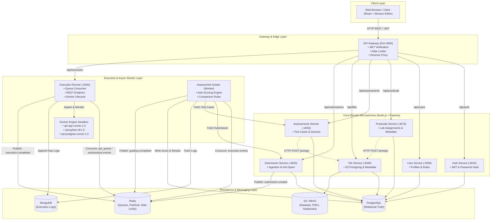
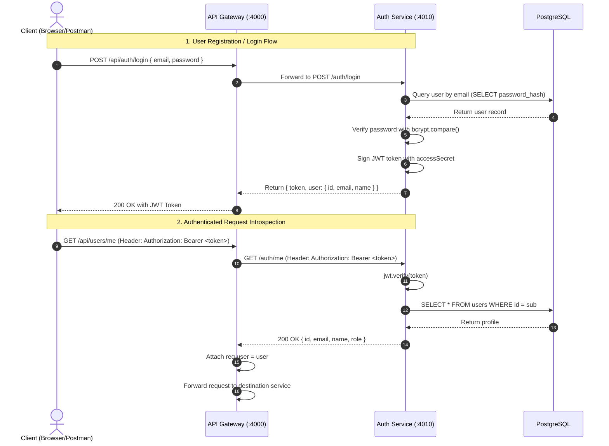
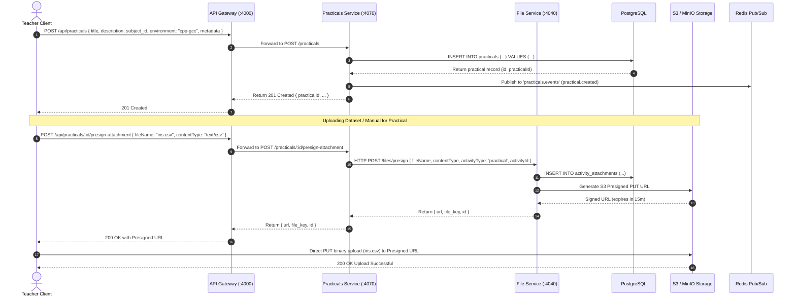
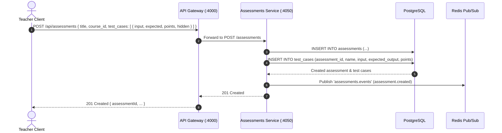
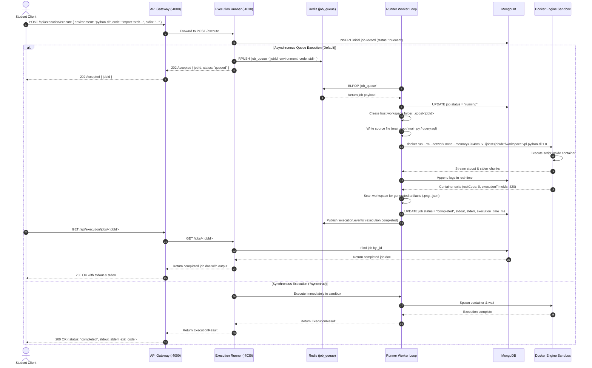
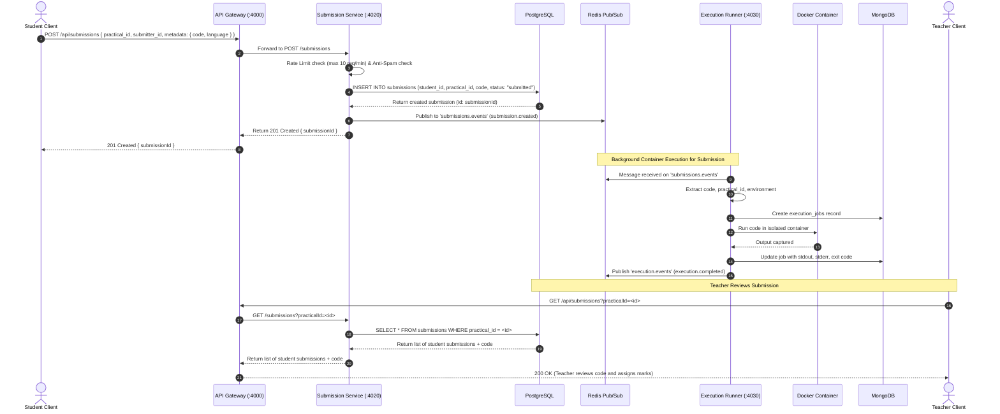
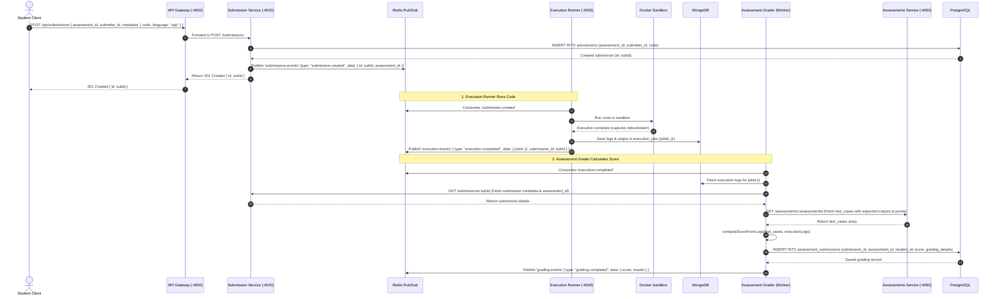
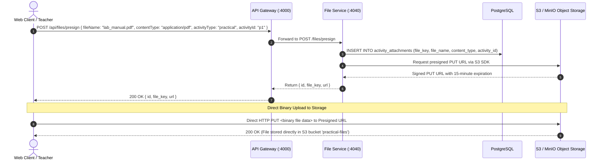

# Virtual Practical Laboratory — System Architecture & Inter-Service Request Mapping

This document provides an exhaustive, end-to-end architectural breakdown of the **AI-Powered Virtual Practical Laboratory Platform**. It maps how requests enter the system, how each microservice interacts with others, which data stores are touched, and how synchronous REST calls and asynchronous event streams coordinate each workflow.

---

## Table of Contents
1. [High-Level System Topology](#1-high-level-system-topology)
2. [Microservices & Responsibilities Matrix](#2-microservices--responsibilities-matrix)
3. [Communication Paradigms](#3-communication-paradigms)
4. [End-to-End Functional Request Flows](#4-end-to-end-functional-request-flows)
   - [Flow 1: User Authentication & Token Introspection](#flow-1-user-authentication--token-introspection)
   - [Flow 2: Practical Assignment Creation & Dataset Attachment](#flow-2-practical-assignment-creation--dataset-attachment)
   - [Flow 3: Assessment Creation with Test Cases](#flow-3-assessment-creation-with-test-cases)
   - [Flow 4: Sandboxed Code Execution ("Run Code" Sandbox)](#flow-4-sandboxed-code-execution-run-code-sandbox)
   - [Flow 5: Practical Lab Submission & Teacher Review](#flow-5-practical-lab-submission--teacher-review)
   - [Flow 6: Assessment Submission & Automated Auto-Grading](#flow-6-assessment-submission--automated-auto-grading)
   - [Flow 7: File Upload & S3/MinIO Presigned URL Handling](#flow-7-file-upload--s3minio-presigned-url-handling)
5. [Data Store Ownership & Event Routing](#5-data-store-ownership--event-routing)
6. [Docker Sandbox Security & Execution Engine](#6-docker-sandbox-security--execution-engine)

---

## 1. High-Level System Topology



---

## 2. Microservices & Responsibilities Matrix

| Service | Port | Primary Responsibility | Data Store Owned | Direct Dependencies |
|---|---|---|---|---|
| **`api-gateway`** | `4000` | Single entry point, request tracing, rate limiting, JWT validation via `auth-service`, and request forwarding. | In-memory / Redis | `auth-service`, all downstream services |
| **`auth-service`** | `4010` | User registration, password hashing (bcrypt), login credential verification, JWT signing, `/me` introspection. | PostgreSQL (`users`, `refresh_tokens`) | PostgreSQL |
| **`user-service`** | `4060` | Profile management, student/teacher role queries, batch and course enrollments. | PostgreSQL (`users`, `user_roles`) | PostgreSQL |
| **`practicals-service`** | `4070` | CRUD for regular lab assignments, starter code, syllabus metadata, and attachment links. | PostgreSQL (`practicals`) | PostgreSQL, `file-service`, Redis |
| **`assessments-service`** | `4050` | Management of timed exams, LeetCode-style challenges, and visible/hidden test cases with point weights. | PostgreSQL (`assessments`, `test_cases`) | PostgreSQL, `file-service`, Redis |
| **`submission-service`** | `4020` | Ingestion of student code submissions, attempt versioning, rate limiting/anti-spam, and event dispatch. | PostgreSQL (`submissions`) | PostgreSQL, Redis |
| **`execution-runner`** | `4030` | Sandboxed Docker container orchestration across 3 consolidated environments, stdout/stderr capture, artifact collection, timeout enforcement. | MongoDB (`execution_jobs`), Host Filesystem (`./jobs`) | Docker Socket, Redis, MongoDB |
| **`assessment-grader`** | Worker | Consumes finished execution events, executes test-case comparison logic, calculates total score, and persists grade records. | PostgreSQL (`assessment_submissions`) | PostgreSQL, MongoDB, Redis, `submission-service`, `assessments-service` |
| **`file-service`** | `4040` | Generates secure time-limited presigned S3/MinIO upload/download URLs and manages attachment metadata. | PostgreSQL (`activity_attachments`), S3/MinIO | S3 / MinIO, PostgreSQL |

---

## 3. Communication Paradigms

```
┌────────────────────────────────────────────────────────────────────────┐
│                        1. Synchronous HTTP / REST                      │
│   Client ──► Gateway ──► Downstream Services (Immediate Read / Write)  │
└────────────────────────────────────────────────────────────────────────┘

┌────────────────────────────────────────────────────────────────────────┐
│                  2. Asynchronous Event-Driven Messaging                │
│   Services emit domain events to Redis Pub/Sub channels:               │
│   • submissions.events  ──► (submission.created)                       │
│   • execution.events    ──► (execution.completed / execution.failed)   │
│   • grading.events      ──► (grading.completed)                        │
│   • practicals.events   ──► (practical.created / practical.updated)    │
│   • assessments.events  ──► (assessment.created)                       │
└────────────────────────────────────────────────────────────────────────┘

┌────────────────────────────────────────────────────────────────────────┐
│                     3. Background Work Queue (Redis)                   │
│   API Gateway / Runner ──► RPUSH 'job_queue' ──► Worker BLPOP          │
└────────────────────────────────────────────────────────────────────────┘
```

---

## 4. End-to-End Functional Request Flows

### Flow 1: User Authentication & Token Introspection

Every incoming request to a protected endpoint passes through the API Gateway's authentication middleware.



- **Call 1.1 (`POST /auth/register` or `/login`):** User sends credentials $\to$ `auth-service` writes or checks hash in PostgreSQL $\to$ generates signed JWT with `{ sub: userId, email, role }`.
- **Call 1.2 (`authMiddleware` on Gateway):** On every subsequent API call, Gateway calls `GET /auth/me` with the `Authorization` header $\to$ `auth-service` validates signature and attaches user context before routing.

---

### Flow 2: Practical Assignment Creation & Dataset Attachment

How teachers create lab practicals with attached datasets, starter code, and execution metadata.



---

### Flow 3: Assessment Creation with Test Cases

How teachers set up timed coding exams with automated test cases.



---

### Flow 4: Sandboxed Code Execution ("Run Code" Sandbox)

When a student clicks **"Run"** in the Monaco editor to test code with standard input before submitting.



---

### Flow 5: Practical Lab Submission & Teacher Review

When a student clicks **"Submit"** on a regular practical assignment.



---

### Flow 6: Assessment Submission & Automated Auto-Grading

When a student submits code for an **Assessment**, triggering the automated test-case grading pipeline.



---

### Flow 7: File Upload & S3/MinIO Presigned URL Handling

How large assets (datasets, PDF manuals, notebook files) are securely uploaded directly to object storage without choking API servers.



---

## 5. Data Store Ownership & Event Routing

### Datastore Separation Principles
1. **PostgreSQL (Source of Truth)**:
   - Owns all relational models: Users, Roles, Institutions, Practicals, Assessments, Test Cases, Submissions, Assessment Submissions, File Metadata.
   - Enforces referential integrity, foreign key cascades, and ACID transactions.
2. **MongoDB (Append-Heavy Execution Logs)**:
   - Owns the `execution_jobs` collection.
   - Stores raw container stdout, stderr, execution traces, and millisecond timing metrics.
3. **Redis (Queuing, Caching, and Real-Time Events)**:
   - **Queue (`job_queue`)**: FIFO execution queue consumed by `execution-runner`.
   - **Rate Limiting (`rl:<ip>`)**: Sliding window counters per client IP.
   - **Pub/Sub Channels**: Inter-service broadcast for decoupled reaction pipelines.
4. **S3 / MinIO (Binary Objects)**:
   - Stores large blobs (CSVs, datasets, PDF manuals, serialized models `.pt`/`.h5`, student notebook templates).

---

## 6. Docker Sandbox Security & Execution Engine

```
┌─────────────────────────────────────────────────────────────────────────────┐
│                          Docker Execution Engine                            │
├─────────────────────────────────────────────────────────────────────────────┤
│  • Security Flags: --network none (Zero outbound network access)            │
│  • Memory Ceilings: --memory=512m (C++/SQL) to --memory=2048m (Python/DL)   │
│  • CPU Limits: --cpus=1.0 to --cpus=2.0                                     │
│  • Ephemeral Lifecycle: Created on demand, auto-destroyed (--rm) on exit    │
│  • Watchdog: Host-side process watchdog kills container if timeout exceeds  │
└─────────────────────────────────────────────────────────────────────────────┘
```

### The 3 Consolidated Runtime Images:

1. **`vpl-cpp-runner:1.0` (Slug: `cpp-gcc`)**:
   - **Covered Subjects**: DSA (C++), OOP, OS
   - **Runtime**: Debian Bookworm, GCC 13, G++, Make, POSIX Threads, Coreutils.
2. **`vpl-python-dl:1.0` (Slug: `python-dl`)**:
   - **Covered Subjects**: DSA (Python), ML, DL, DS
   - **Runtime**: Python 3.11, PyTorch (`torch`, `torchvision`), Scikit-Learn, Pandas, NumPy, Matplotlib, Seaborn, SciPy, Jupyter Nbconvert.
3. **`vpl-postgres-runner:1.0` (Slug: `postgres-dbms`)**:
   - **Covered Subjects**: DBMS
   - **Runtime**: PostgreSQL 16, `psql`, Python 3 + `psycopg2` query sidecar delivering JSON result grids.
