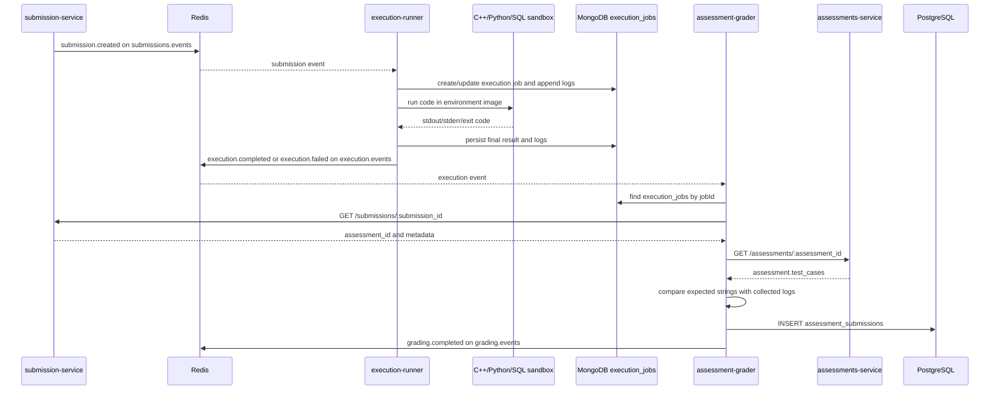

# Assessment Grader: Internal Working

This document describes the current implementation of `assessment-grader`, including the parts that are incomplete or differ from the intended end-to-end grading design. The service is a background worker, not an HTTP API.

## Responsibility

The grader listens for execution result events, looks up the execution job and related records, calculates a score, stores a grading record in PostgreSQL, and publishes a grading event.

It does **not** compile or run student code itself. Code execution belongs to `execution-runner` and its Docker environment images.

## End-to-End Flow



The grader only consumes `execution.events`. The grader does not subscribe to `submissions.events` or `assessments.events`.

## Startup and Connections

Startup is in [`services/assessment-grader/src/index.ts`](services/assessment-grader/src/index.ts):

1. Connect to MongoDB using `MONGO_URI`.
2. Initialize a PostgreSQL pool and run `SELECT 1`.
3. Connect to Redis and subscribe to `execution.events`.
4. Handle messages whose type is `execution.completed` or `execution.failed`.

A MongoDB or PostgreSQL startup failure exits the process. A Redis connection failure is logged as a warning; the process can remain up without consuming events. There is no HTTP listener or health endpoint in this service.

Local development:

```powershell
cd services/assessment-grader
npm install
npm run dev
```

The package also defines `npm run build` and `npm start`. Check the grader Dockerfile before relying on its container command: unlike the assessments-service Dockerfile, it does not run a TypeScript build step before invoking `dist/index.js`.

## Event Contracts

### Input: `execution.events`

The execution runner publishes JSON shaped like this after execution:

```json
{
  "type": "execution.completed",
  "data": {
    "jobId": "<execution-job-id>",
    "submission_id": "<submission-id>",
    "assessment_id": "<optional-assessment-id>",
    "status": "completed",
    "stdout": "program output",
    "stderr": "",
    "exit_code": 0
  }
}
```

`execution.failed` is handled by the same grader path. The grader uses `data.jobId` and `data.submission_id`; it then reads the submission and assessment through their HTTP APIs. Although other result fields are published, the current scoring code does not use the event's `stdout`, `stderr`, or `exit_code` directly.

The execution runner writes job documents into MongoDB collection `execution_jobs`. The grader reads that same collection and uses the job's `logs` array. Both services must point at the same MongoDB database for this lookup to work.

### Output: `grading.events`

After storing a grade, the service publishes:

```json
{
  "type": "grading.completed",
  "data": {
    "assessment_submission_id": "<grading-record-id>",
    "submission_id": "<submission-id>",
    "score": 100,
    "results": [
      { "name": "case 1", "expected": "42", "ok": true, "points": 1 }
    ]
  }
}
```

Redis Pub/Sub is transient: a consumer that is disconnected when the event is published does not receive it later. The worker does not use a durable queue or acknowledgement protocol for these events.

## Grading Algorithm As Implemented

The code is in [`services/assessment-grader/src/worker.ts`](services/assessment-grader/src/worker.ts), in `computeScoreFromLogs` and `handleExecutionCompleted`.

1. Find the job in MongoDB using `_id = data.jobId`. If it is absent, log `job not found` and stop.
2. Fetch `GET {SUBMISSION_SERVICE_URL}/submissions/{submission_id}`.
3. If the submission has no `assessment_id`, log that there is no linked assessment and stop without creating a grade.
4. Fetch `GET {ASSESSMENTS_SERVICE_URL}/assessments/{assessment_id}`.
5. Join `job.logs[].line` into text and append `submission.metadata.output`.
6. For each object in `assessment.test_cases`, compare its `expected` value to the combined text using a case-sensitive substring search.
7. Sum earned points and divide by total points to produce a percentage from 0 to 100.
8. Insert the result into PostgreSQL, then publish `grading.completed`.

The effective test-case shape is:

```json
{
  "name": "prints the answer",
  "expected": "42",
  "points": 5
}
```

`points` defaults to `1` when it is missing or zero because the implementation uses `tc.points || 1`. Empty or missing `expected` values never pass. An empty test-case list produces score `0` and no result rows. The score is a percentage, not the raw sum of points.

### What This Algorithm Does Not Do

- It does not execute each test case with a separate input.
- It does not compare complete output lines or normalize whitespace.
- It does not use the `expected_output` property used by the root schema's relational `test_cases` table; it reads JSON test cases with an `expected` property.
- It does not reject or special-case `execution.failed`; failed executions go through the same substring scoring path.
- It does not check an execution exit code before awarding points.

This is currently output-presence scoring, not isolated hidden-test grading.

## Persistence and Dependencies

- **MongoDB:** `execution_jobs` collection, read by job ID for execution logs. Configured with `MONGO_URI`.
- **PostgreSQL:** `assessment_submissions` table, written by [`assessmentSubmissionRepo.ts`](services/assessment-grader/src/models/assessmentSubmissionRepo.ts). Configured with `POSTGRES_HOST`, `POSTGRES_PORT`, `POSTGRES_DB`, `POSTGRES_USER`, and `POSTGRES_PASSWORD` through shared config.
- **Redis:** Pub/Sub channel `execution.events` for input and `grading.events` for output. Configured with `REDIS_URL`.
- **HTTP services:** submission-service and assessments-service. Defaults come from shared config and may be overridden with `SUBMISSION_SERVICE_URL` and `ASSESSMENTS_SERVICE_URL`.

The grader's PostgreSQL helper builds a host/port pool and does not read `DATABASE_URL` or `POSTGRES_DATABASE_URL`. Make sure these individual PostgreSQL variables point to the intended database.

The current insert stores `id`, `submission_id`, `assessment_id`, `grader_results` (JSONB), `score`, `created_at`, and `updated_at`. It has no upsert or duplicate-event protection; receiving the same execution event twice can create duplicate grading records.

## Database Migration Compatibility

The service migration is [`services/assessment-grader/migrations/20260816_create_assessment_submissions.sql`](services/assessment-grader/migrations/20260816_create_assessment_submissions.sql). It defines a table with `id`, `submission_id`, `assessment_id`, `grader_results`, `score`, `created_at`, and `updated_at`.

This does **not** match the `assessment_submissions` table in the root [`migrations/20260816_initial_schema.sql`](migrations/20260816_initial_schema.sql), which requires `student_id` and uses fields such as `graded` and `grading_details`. It also does not match [`migrations/20260815_separate_assessment_submissions.sql`](migrations/20260815_separate_assessment_submissions.sql), which uses `auto_score`, `test_results`, and `status`.

All three definitions cannot be treated as interchangeable. `CREATE TABLE IF NOT EXISTS` does not alter a table that already exists. Choose and apply a schema that matches the running writer before using grading; otherwise its insert can fail at runtime.

## Source Map

- [`src/index.ts`](services/assessment-grader/src/index.ts): connects dependencies and subscribes to Redis.
- [`src/worker.ts`](services/assessment-grader/src/worker.ts): consumes execution events, fetches records, scores, stores, and publishes.
- [`src/models/assessmentSubmissionRepo.ts`](services/assessment-grader/src/models/assessmentSubmissionRepo.ts): PostgreSQL insert.
- [`src/utils/mongo.ts`](services/assessment-grader/src/utils/mongo.ts): execution-job collection accessor.
- [`src/utils/db.ts`](services/assessment-grader/src/utils/db.ts): PostgreSQL pool.
- [`migrations/20260816_create_assessment_submissions.sql`](services/assessment-grader/migrations/20260816_create_assessment_submissions.sql): service-specific grading table DDL.

## Current Operational Gaps

- Redis Pub/Sub events are not durable or replayed after downtime.
- The grader does not guard against duplicate events or duplicate grade records.
- HTTP, MongoDB, PostgreSQL, and Redis message errors are logged/propagated without a retry or dead-letter workflow.
- A missing Mongo job stops processing; an event without a submission ID is not validated before constructing the HTTP request.
- The service has no health endpoint or graceful shutdown handler.
- The score is based on substring matching logs, not independently executed test cases.
