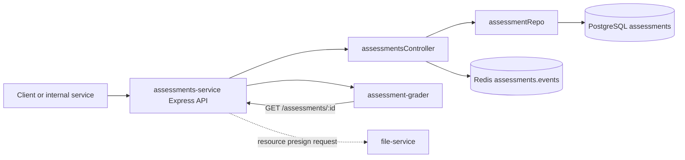

# Assessments Service: Internal Working

This guide documents the behavior currently implemented by `assessments-service`, rather than the broader product intent. The service is an Express API backed by PostgreSQL. It stores assessment definitions and exposes them to other services, including `assessment-grader`.

## Responsibility and Boundaries

The service currently handles:

- Creating an assessment definition and publishing `assessment.created`.
- Listing assessments, optionally filtered by `course_id`.
- Fetching one assessment by ID.
- Requesting a presigned resource upload through `file-service` (the current proxy contract has a mismatch; see below).

It does not currently implement assessment update/delete, student attempts, execution, or grading. Execution and grading are separate services.

## Request Flow



For assessment creation, the controller validates `title` and `course_id`, writes the record, then publishes an event. The response is sent only after the publish step succeeds. This means a Redis publish failure can produce an HTTP 500 even though the PostgreSQL insert has already committed.

## HTTP Startup and Routes

The listener is started by [`services/assessments-service/src/index.ts`](services/assessments-service/src/index.ts) after PostgreSQL passes a `SELECT 1` check. The default port is `4050` (overridable with `PORT` or `PORT_ASSESSMENTS_SERVICE`). JSON request bodies are limited to 5 MB; CORS is enabled.

The routes are declared in [`src/routes.ts`](services/assessments-service/src/routes.ts) and mounted twice by `src/index.ts`: once at `/assessments` and once at `/`. The public, documented paths are:

| Method and path | Behavior | Success response |
|---|---|---|
| `GET /health` | Intended basic process health; currently shadowed by the root `GET /:id` route | As currently mounted, it can be treated as assessment ID `health` and return a database error instead of the health JSON |
| `POST /assessments` | Create an assessment | `201` with the inserted row |
| `GET /assessments` | List up to 100 assessments, newest first | `200` array |
| `GET /assessments?course_id=<uuid>` | List assessments for a course | `200` array |
| `GET /assessments/:id` | Fetch one assessment | `200` row or `404 { "error": "not found" }` |
| `POST /assessments/:id/presign-resource` | Proxy a resource upload request | Intended to return file-service JSON; see mismatch below |

Because the same router is also mounted at `/`, root aliases are registered too: `POST /`, `GET /`, `GET /:id`, and `POST /:id/presign-resource`. Prefer the `/assessments` paths.

The health handler is registered after both router mounts. Therefore, `GET /health` matches the root alias `GET /:id` first; with the UUID database column, this normally produces a PostgreSQL UUID error rather than reaching the health handler. Register health before the root-mounted router or remove the root alias to make the health endpoint reachable.

There is no authentication or authorization middleware in this service itself. Deployments may put the API behind a gateway, but direct service requests are not authenticated by this code.

## Create Assessment Contract

`POST /assessments` accepts this implemented shape:

```json
{
  "title": "Binary Search Assessment",
  "course_id": "<course-uuid>",
  "description": "Implement the required algorithms.",
  "metadata": {
    "duration_minutes": 45
  },
  "test_cases": [
    {
      "name": "prints expected value",
      "expected": "42",
      "points": 5
    }
  ],
  "resources": []
}
```

Only `title` and `course_id` are checked by the controller. Missing either returns `400 { "error": "title and course_id required" }`. The other fields are passed through to PostgreSQL as JSONB values; their shape is not validated. The repository generates a UUID when `id` is not provided, stores missing optional fields as SQL `NULL`, and returns the inserted row.

The grader currently expects each JSON test case to have `expected` (a string to search for in output) and optionally `name` and `points`. A relational test-case row using `expected_output` is not read by this grader path.

The service publishes the complete created row as:

```json
{
  "type": "assessment.created",
  "data": { "id": "<assessment-uuid>", "title": "..." }
}
```

on Redis channel `assessments.events`. The current `assessment-grader` does not consume this event; it fetches assessments over HTTP when it handles an execution event.

## Read Behavior

- `GET /assessments` returns at most 100 rows ordered by `created_at DESC`.
- Supplying `course_id` selects rows whose `course_id` exactly matches the query string, ordered newest first.
- `GET /assessments/:id` performs an exact ID lookup and returns the complete database row, including JSONB fields.
- Database errors are logged to the service process and returned as `500 { "error": "failed" }`.

The service does not validate UUID syntax before passing query parameters to PostgreSQL.

## Resource Presign Path

The intended flow is that a client calls `POST /assessments/:id/presign-resource`, then uploads directly to the returned object-storage URL. The current controller only reads `filename` and `contentType`, then calls:

```text
POST {FILE_SERVICE_URL}/presign
```

However, `file-service` mounts its routes under `/files`, so its route is `POST /files/presign`. Its controller also requires `fileName`, `contentType`, `activityType`, `activityId`, and `uploadedBy`, whereas this proxy sends only `{ filename, contentType }`.

As currently implemented, the proxy request will not satisfy the file-service contract (normally resulting in 404 at the path or 400 for missing fields). The `id` in the resource endpoint is not forwarded in the payload. Resource upload through this endpoint requires aligning the URL and payload with [`services/file-service/src/controllers/fileController.ts`](services/file-service/src/controllers/fileController.ts).

## Database Model and Migration

The service repository [`src/models/assessmentRepo.ts`](services/assessments-service/src/models/assessmentRepo.ts) expects this table shape from [`migrations/20260816_create_assessments.sql`](services/assessments-service/migrations/20260816_create_assessments.sql):

- `id UUID` primary key
- `title TEXT NOT NULL`
- `course_id UUID NOT NULL`
- `description TEXT`
- `metadata JSONB`
- `test_cases JSONB`
- `resources JSONB`
- `created_at`, `updated_at`

The migration creates an index on `course_id`. The repository inserts all fields and performs direct SQL reads; there is no ORM or transaction layer. Database connection settings come from the shared `POSTGRES_HOST`, `POSTGRES_PORT`, `POSTGRES_DB`, `POSTGRES_USER`, and `POSTGRES_PASSWORD` configuration. This helper does not use `DATABASE_URL` or `POSTGRES_DATABASE_URL`.

### Root Schema Compatibility Warning

The root [`migrations/20260816_initial_schema.sql`](migrations/20260816_initial_schema.sql) defines `assessments` differently: it uses `institution_id` and `subject_id`, and does not define the `course_id`, `test_cases`, or `resources` columns expected by this service. It also models test cases in a separate table.

Both migrations use `CREATE TABLE IF NOT EXISTS`. If the root migration creates `assessments` first, the service migration will not add the columns required by this API. Creating an assessment will then fail. Select a single compatible schema strategy or write and apply an explicit reconciliation migration; do not assume running both files makes their definitions merge.

## Runtime Configuration and Local Development

Relevant settings:

| Setting | Purpose | Default |
|---|---|---|
| `PORT` / `PORT_ASSESSMENTS_SERVICE` | HTTP listener | `4050` |
| `POSTGRES_HOST` | PostgreSQL host | `localhost` |
| `POSTGRES_PORT` | PostgreSQL port | `5432` |
| `POSTGRES_DB` | Database name | `practical_db` |
| `POSTGRES_USER` | Database user | `postgres` |
| `POSTGRES_PASSWORD` | Database password | `postgres` |
| `REDIS_URL` | Publishes `assessments.events` | shared config default, `redis://localhost:6379` |
| `FILE_SERVICE_URL` | Resource proxy base URL | shared config default, `http://localhost:4040` |

Start locally:

```powershell
cd services/assessments-service
npm install
npm run dev
```

The service requires its PostgreSQL schema to be applied before startup can complete. Redis is not tested during startup, but assessment creation attempts to publish through Redis using the shared default URL. File-service is only needed for the resource proxy path.

## Source Map

- [`src/index.ts`](services/assessments-service/src/index.ts): Express setup, route mounting, database initialization, listener.
- [`src/app.ts`](services/assessments-service/src/app.ts): placeholder Express app; the package's `dev` and `start` scripts use `src/index.ts`, not this file.
- [`src/routes.ts`](services/assessments-service/src/routes.ts): route-to-controller mapping.
- [`src/controllers/assessmentsController.ts`](services/assessments-service/src/controllers/assessmentsController.ts): validation, HTTP behavior, Redis event, file-service proxy.
- [`src/models/assessmentRepo.ts`](services/assessments-service/src/models/assessmentRepo.ts): SQL create/list/find operations.
- [`src/utils/db.ts`](services/assessments-service/src/utils/db.ts): PostgreSQL pool setup.
- [`migrations/20260816_create_assessments.sql`](services/assessments-service/migrations/20260816_create_assessments.sql): service-specific table DDL.

## Current Limitations

- There are no update/delete operations despite broader wording in older service documentation.
- There is no schema-level validation for JSON fields or UUID request parameters.
- Publishing `assessment.created` happens after the database insert without an outbox; publish failure can make a committed insert appear as a failed HTTP request.
- `GET /health` reports process status only, not live database or Redis status.
- The presign proxy URL and payload do not match file-service's current endpoint contract.
- The service-specific and root assessment schemas are incompatible when applied to the same database without reconciliation.
