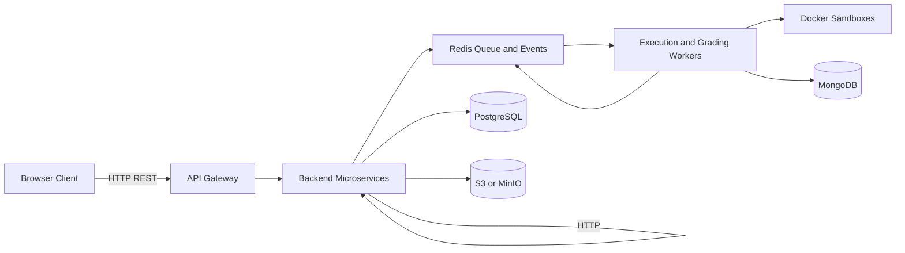
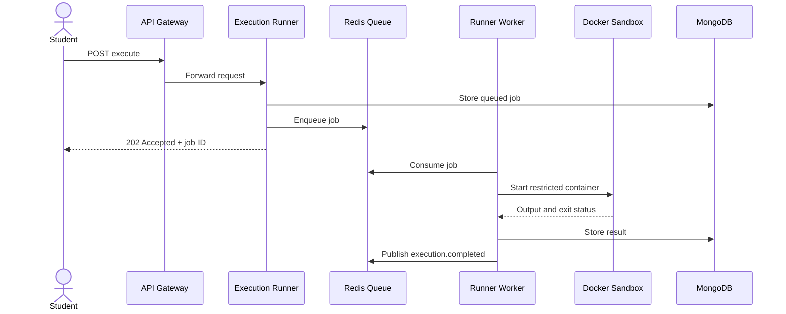
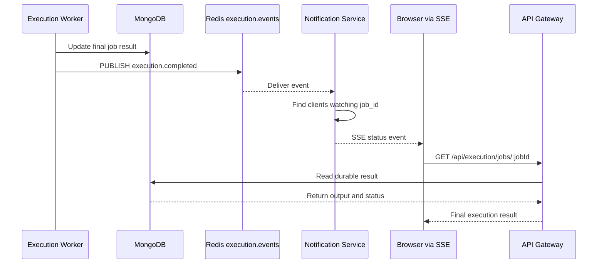
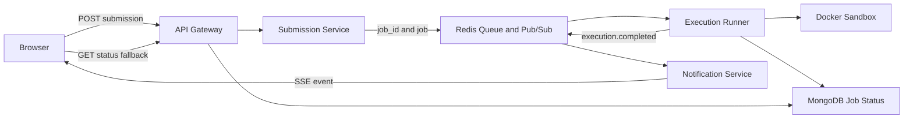

# Distributed Systems & Networking in This Project

This project is a practical example of distributed systems and computer networking concepts. It is not a single application process. Multiple services, workers, databases, queues, storage systems, and Docker containers communicate over a network to deliver one user experience.

The project can be explained as:

> A browser client communicates with an API Gateway. The Gateway routes requests to independent backend services. Long-running code execution is placed on a Redis queue, processed by workers in isolated Docker containers, and reported back through persistent storage and events.

## 1. Where Distributed Systems Are Used



The distributed-system concepts appear in these areas:

| Project area | Distributed-system concept |
|---|---|
| API Gateway and services | Service decomposition and network communication |
| Redis job queue | Asynchronous processing, buffering, backpressure, and load distribution |
| Execution Runner workers | Worker-pool and horizontal-scaling pattern |
| Assessment Grader | Event-driven processing and eventual consistency |
| PostgreSQL, MongoDB, Redis, and S3/MinIO | Polyglot persistence and data ownership |
| Docker execution containers | Isolation and resource governance |
| Immutable submissions | Reliable history, auditability, and conflict avoidance |
| Health checks and service boundaries | Failure detection and fault isolation |
| Request IDs and logs | Distributed observability and tracing |

## 2. Service-to-Service Communication

The system is divided into services with focused responsibilities:

- `api-gateway`: public entry point, routing, authentication checks, and rate limiting.
- `auth-service`: credentials, password hashing, JWTs, and token introspection.
- `practicals-service`: regular laboratory assignments.
- `assessments-service`: timed assessments and test cases.
- `submission-service`: versioned student submissions and submission events.
- `execution-runner`: queued Docker execution.
- `assessment-grader`: automatic assessment scoring.
- `file-service`: presigned object-storage URLs and attachment metadata.

This is a distributed architecture because each service can run as a separate process or container, possibly on a separate machine. A request crosses process and network boundaries instead of calling every feature in one in-memory module.

### Why split the services?

The services have different responsibilities and scaling needs. For example, the execution runner may require several workers during a practical examination, while the authentication service may have a much smaller and steadier workload. Separating them allows independent deployment, scaling, and failure isolation.

The trade-off is that network calls can fail, responses can be delayed, and debugging becomes more difficult than in a monolith. The system therefore needs timeouts, structured errors, health checks, logs, and retry policies.

## 3. Networking Concepts Used

### 3.1 HTTP and REST

The browser communicates with the API Gateway using HTTP REST requests.

Examples include:

```text
POST /api/auth/login
GET  /api/practicals/:id
POST /api/submissions
POST /api/execution/execute
GET  /api/execution/jobs/:jobId
```

The Gateway forwards authenticated requests to internal services over HTTP. HTTP provides the request-response model, status codes, headers, authentication tokens, and JSON payloads used by the application.

### 3.2 API Gateway Pattern

The browser should not need to know the location or port of every internal service. It communicates with one public entry point, while the Gateway routes requests internally.

```text
Browser
  |
  | HTTP + JWT
  v
API Gateway :4000
  |-- Auth Service        :4010
  |-- Submission Service  :4020
  |-- Execution Runner    :4030
  |-- File Service        :4040
  |-- Assessments Service :4050
  |-- User Service        :4060
  |-- Practicals Service  :4070
```

This provides a central place for:

- JWT validation and user context.
- Role-based access checks.
- Rate limiting.
- Request tracing.
- Routing and consistent error handling.

The Gateway must not become a bottleneck or a single point of failure in production. It can be replicated behind a load balancer, with shared rate-limit and session state stored in Redis where needed.

### 3.3 TCP and Reliable Delivery

HTTP normally runs over TCP. TCP provides ordered and reliable delivery between network endpoints. That is useful for API calls, service-to-service requests, database connections, Redis connections, and object-storage uploads.

TCP does not guarantee that the application operation happened exactly once. A client can lose its response after the server has already created a submission. Therefore, application-level idempotency is still needed for sensitive operations.

### 3.4 Ports, Service Discovery, and Container Networking

Each service listens on a port, such as the Gateway on `4000` or the Execution Runner on `4030`. In Docker Compose or another deployment platform, services communicate using service names and internal networks rather than hard-coded machine addresses.

The important distinction is:

- **Application network:** trusted services communicate through HTTP, PostgreSQL, Redis, MongoDB, or S3-compatible APIs.
- **Student execution network:** the code container uses `--network none` so student programs cannot make outbound network connections.

The platform needs networking to coordinate trusted components, while deliberately removing networking from untrusted student code.

### 3.5 DNS and Service Names

In a containerized deployment, a service such as `execution-runner` can be addressed through an internal DNS name. Environment variables such as `REDIS_URL`, `MONGO_URI`, and service URLs keep deployment configuration outside the code.

This allows the same service image to run locally, in Docker Compose, or in a larger cluster with different addresses.

### 3.6 TLS and Secure Transport

In production, browser-to-Gateway traffic should use HTTPS. Internal service traffic should also use encrypted transport when it crosses hosts or an untrusted network. Database, Redis, MongoDB, and object-storage credentials must be supplied through secrets rather than committed to the repository.

## 4. Asynchronous Communication with Redis

Code execution is not performed directly inside the HTTP request. The Execution Runner creates a job and places it on a Redis queue.



This uses two related messaging patterns:

### Work queue

A job queue distributes work to available workers. The queue prevents every API process from starting containers directly and provides buffering when many students click **Run** at the same time.

A queue helps with:

- **Load leveling:** sudden bursts wait in the queue instead of overwhelming the host.
- **Backpressure:** workers process only as many jobs as the available resources allow.
- **Horizontal scaling:** more runner workers can consume jobs when demand grows.
- **Priority:** submission jobs can receive higher priority than exploratory runs.

### Pub/sub events

After execution, the runner publishes an event such as `execution.completed`. The assessment grader can subscribe to that event without the runner needing to call the grader directly.

Important events include:

```text
submission.created
execution.completed
execution.failed
grading.completed
practical.created
assessment.created
```

This reduces direct coupling between services. The trade-off is eventual consistency: a submission may exist before its execution result or final score is available.

## 5. Eventual Consistency in the Project

A student assessment submission is processed in stages:

1. The submission is stored.
2. The execution job is queued.
3. The code runs in a Docker container.
4. Execution output is stored.
5. The grader calculates the score.
6. The final score becomes available.

These steps do not need to happen inside one long database transaction. The UI can display states such as:

```text
Submitted -> Queued -> Running -> Executed -> Grading -> Graded
```

This is an example of eventual consistency. Different services may briefly show different states, but events and persisted records eventually bring the workflow to a consistent result.

The UI should represent this honestly with statuses and polling or WebSocket updates. It should not assume that a successful `POST /submissions` means grading has already finished.

## 6. User Notification After Asynchronous Execution

The user should not keep the original HTTP request open until Docker finishes. The better design is:

```text
1. Client submits code
2. API stores the submission and creates a job ID
3. API returns HTTP 202 Accepted immediately
4. Redis delivers the job to an execution worker
5. Worker runs the code in Docker
6. Worker stores the result in MongoDB
7. Worker publishes execution.completed or execution.failed
8. Notification layer informs the browser
9. Browser requests or receives the final result using the job ID
```

### Detailed explanation of steps 7 to 9

The last three steps separate **internal service communication** from **browser notification** and **durable result retrieval**. The browser does not need to stay connected directly to the Docker worker. The worker finishes the job, stores the result, publishes an event, and a notification layer forwards a small status update to the correct browser connection.



#### Step 7: The worker publishes a completion event

After Docker exits, the Execution Runner already has the information needed to determine the final result:

```ts
const result = {
  jobId,
  status: 'completed',
  stdout: stdoutAccum,
  stderr: stderrAccum,
  exit_code: exitCode,
  execution_time_ms: executionTimeMs,
  artifacts
};
```

The worker first persists this result in MongoDB. This order is important: the durable result should exist before the notification is sent.

```ts
await JobStore.update(jobId, {
  status: result.status,
  completed_at: new Date(),
  execution_time_ms: result.execution_time_ms,
  exit_code: result.exit_code,
  stdout: result.stdout,
  stderr: result.stderr,
  artifacts: result.artifacts
});
```

Then it publishes an event to Redis:

```ts
await redisPublisher.publish(
  'execution.events',
  JSON.stringify({
    type: 'execution.completed',
    data: {
      jobId: result.jobId,
      status: result.status,
      exit_code: result.exit_code,
      execution_time_ms: result.execution_time_ms,
      stdout: result.stdout,
      stderr: result.stderr,
      artifacts: result.artifacts
    }
  })
);
```

For a failure or timeout, the event type and status change:

```json
{
  "type": "execution.failed",
  "data": {
    "jobId": "job-456",
    "status": "time_limit_exceeded",
    "exit_code": null,
    "execution_time_ms": 30000
  }
}
```

Redis is used here as an internal event transport. The worker does not need to know which browser, grader, or monitoring service is interested in the result. Every interested consumer can subscribe to `execution.events`.

#### Step 8: The notification layer informs the browser

The notification layer is a small service responsible for translating internal Redis events into browser notifications. It performs four actions:

1. Subscribe to Redis `execution.events`.
2. Parse the event and read its `jobId`.
3. Find the browser connection registered for that `jobId`.
4. Send a status update through Server-Sent Events (SSE).

Conceptually, it maintains a connection map:

```ts
const clientsByJob = new Map<string, Set<Response>>();
```

When the browser opens:

```http
GET /api/execution/jobs/job-456/events
Accept: text/event-stream
```

the notification service registers that connection:

```ts
const clients = clientsByJob.get(jobId) ?? new Set<Response>();
clients.add(response);
clientsByJob.set(jobId, clients);

request.on('close', () => {
  clients.delete(response);
});
```

When Redis delivers the event, the service forwards it only to clients watching the matching job:

```ts
redisSubscriber.on('message', (_channel, rawMessage) => {
  const event = JSON.parse(rawMessage);
  const jobId = event.data.jobId;
  const clients = clientsByJob.get(jobId) ?? new Set<Response>();

  for (const response of clients) {
    response.write(`data: ${JSON.stringify(event.data)}\n\n`);
  }
});
```

The browser receives a message such as:

```text
data: {"jobId":"job-456","status":"completed","exit_code":0}
```

The browser can update the interface immediately:

```ts
const events = new EventSource(
  `/api/execution/jobs/${jobId}/events`
);

events.onmessage = (message) => {
  const update = JSON.parse(message.data);

  showStatus(update.status);

  if (['completed', 'failed', 'time_limit_exceeded']
      .includes(update.status)) {
    events.close();
    loadFinalResult(jobId);
  }
};
```

SSE is a one-way HTTP connection: the browser listens, and the server sends updates. This is enough for execution status because the browser does not need to send commands over the same connection.

#### Step 9: The browser receives or requests the final result

The notification should contain enough information to update the status, but MongoDB remains the authoritative source for the complete result. The browser should call the status endpoint after receiving a terminal event:

```ts
async function loadFinalResult(jobId: string) {
  const response = await fetch(
    `/api/execution/jobs/${jobId}`
  );

  if (!response.ok) {
    throw new Error('Unable to load execution result');
  }

  const job = await response.json();
  renderOutput(job.stdout);
  renderErrors(job.stderr);
  renderArtifacts(job.artifacts);
  renderExecutionTime(job.execution_time_ms);
}
```

The final response may contain:

```json
{
  "job_id": "job-456",
  "status": "completed",
  "stdout": "Hello from Docker\n",
  "stderr": "",
  "exit_code": 0,
  "execution_time_ms": 340,
  "artifacts": []
}
```

The status endpoint is essential for recovery. If the browser was closed, the network failed, or the SSE connection was opened after the event was published, the user can still retrieve the result using the job ID.

The complete recovery behavior is:

```text
SSE event received
    -> browser displays the new status
    -> browser calls GET /jobs/:jobId
    -> API reads MongoDB
    -> browser displays the durable output

SSE connection lost
    -> browser reconnects or falls back to polling
    -> browser calls GET /jobs/:jobId
    -> same durable result is returned
```

#### Why the notification is not the source of truth

Redis Pub/Sub is fast, but a disconnected subscriber can miss a message. Therefore:

- Redis event: fast notification mechanism.
- SSE: live browser delivery mechanism.
- MongoDB: durable execution result.
- `GET /api/execution/jobs/:jobId`: recovery mechanism.

This design prevents a lost browser connection from becoming a lost execution result.

### Recommended request and response

The submission endpoint should return quickly:

```http
POST /api/submissions
Authorization: Bearer <token>
Content-Type: application/json
```

```json
{
  "practical_id": "prac-123",
  "environment": "cpp-gcc",
  "code": "#include <iostream>...",
  "stdin": "5"
}
```

The API should not wait for compilation. It stores the submission, creates a stable job ID, publishes or enqueues the execution job, and returns:

```http
HTTP/1.1 202 Accepted
```

```json
{
  "submission_id": "sub-123",
  "job_id": "job-456",
  "status": "queued",
  "status_url": "/api/execution/jobs/job-456"
}
```

`202 Accepted` means the server accepted the work, not that the code has already run successfully. The job ID is the correlation key used by the browser, Execution Runner, MongoDB record, Redis event, and optional notification service.

### Option A: HTTP polling

Polling is the simplest option and fits the existing repository because the Execution Runner already stores job status in MongoDB and exposes job status concepts.

```text
Browser                         API Gateway             Execution Runner
   |                                  |                         |
   | POST /submissions                |                         |
   |--------------------------------->|                         |
   |<------ 202 + job_id -------------|                         |
   |                                  |                         |
   | GET /execution/jobs/job-456      |                         |
   |--------------------------------->|------------------------>|
   |<------ queued/running -----------|<------------------------|
   |                                  |                         |
   | GET /execution/jobs/job-456      |                         |
   |--------------------------------->|------------------------>|
   |<------ completed + output -------|<------------------------|
```

Example client logic:

```ts
async function waitForExecution(jobId: string) {
  while (true) {
    const response = await fetch(`/api/execution/jobs/${jobId}`);
    const job = await response.json();

    if (['completed', 'failed', 'time_limit_exceeded'].includes(job.status)) {
      return job;
    }

    await new Promise((resolve) => setTimeout(resolve, 1000));
  }
}
```

Polling has these advantages:

- Easy to implement and debug.
- Works through normal HTTP infrastructure and load balancers.
- The client can recover after a browser refresh because the job ID is persisted.
- No continuously open connection is required.

Its disadvantage is extra requests. The client should use a reasonable interval, stop polling after a terminal state, and use exponential backoff for long-running jobs. The API can also return `Retry-After` to suggest the next polling interval.

### Option B: Server-Sent Events for one-way updates

For this project, **Server-Sent Events (SSE)** are a strong choice for live execution updates. The browser only needs to receive status changes; it does not need to send messages over the same connection.

```text
Browser --POST /submissions--------------------> API
Browser <--202 + job_id------------------------- API
Browser --GET /execution/jobs/job-456/events--> API
                                                   ^
                                                   |
                                      Redis execution.events
                                                   ^
                                                   |
                                      Execution Runner
```

The browser opens one long-lived HTTP connection:

```ts
const events = new EventSource(
  `/api/execution/jobs/${jobId}/events`
);

events.onmessage = (message) => {
  const update = JSON.parse(message.data);

  if (['completed', 'failed', 'time_limit_exceeded']
      .includes(update.status)) {
    events.close();
  }
};
```

The Gateway or a notification service subscribes to Redis `execution.events`, filters events by `job_id`, and writes them to the matching SSE connection:

```text
Redis event:
{
  "type": "execution.completed",
  "data": {
    "jobId": "job-456",
    "status": "completed",
    "stdout": "Hello\n",
    "exit_code": 0
  }
}

SSE message:
data: {"jobId":"job-456","status":"completed",...}
```

SSE is appropriate when:

- The server sends updates in one direction.
- The browser needs live status without frequent polling.
- Updates are normal HTTP text events.
- Automatic browser reconnect behavior is useful.

SSE does not remove the need for MongoDB. Redis events can be missed while a browser is disconnected, so the client should use the `job_id` to fetch the final durable result from the status endpoint after reconnecting.

### Option C: WebSocket

WebSocket is useful if the application needs two-way, real-time communication, such as:

- Interactive terminal input during execution.
- Live log streaming with client commands.
- Collaborative editing.
- Teacher and student presence.
- Pause, cancel, or control messages over the same connection.

For only “tell me when my submission finished,” WebSocket adds more connection-management complexity than necessary. It is still a valid future option if the platform later needs bidirectional execution control.

```text
Browser <======== WebSocket ========> API Gateway
                                         |
                                         +--> Redis subscription
                                         +--> Execution Runner events
```

### Recommended choice for this project

Use a two-layer approach:

1. **HTTP `POST` + `202 Accepted`** to create the submission and return a job ID.
2. **MongoDB status endpoint** as the durable source of truth.
3. **SSE** for live one-way updates when the browser is connected.
4. **Polling fallback** after refresh, reconnect, or when SSE is unavailable.
5. **Redis pub/sub** internally between the Execution Runner and notification layer.

This gives a fast API response, low request overhead, reliable recovery, and live user feedback without holding an application request open during Docker execution.

### Notification service design

A dedicated notification service can consume `execution.events` and forward updates to connected clients:



The notification service would maintain a map of connected clients to job IDs. When it receives an event, it sends the update only to clients watching that job. It should not be the source of truth; MongoDB remains the durable record.

### Status state machine

The user interface and services should use explicit states:

```text
SUBMITTED
    |
    v
QUEUED --> REJECTED
    |
    v
RUNNING --> FAILED
    |
    +------> TIME_LIMIT_EXCEEDED
    |
    v
EXECUTED
    |
    v
GRADING --------------+
    |                  |
    v                  v
GRADED             GRADING_FAILED
```

The browser can display these states immediately:

| State | Meaning shown to the user |
|---|---|
| `queued` | Submission accepted and waiting for a worker |
| `running` | A worker has started the Docker container |
| `completed` or `executed` | Code ran and output is available |
| `failed` | Compilation, runtime, or infrastructure failure occurred |
| `time_limit_exceeded` | The runner stopped the job after its limit |
| `grading` | Assessment test-case evaluation is in progress |
| `graded` | Score and test-case results are available |

### Why this reduces server load

The original `POST` request is short-lived. It only validates the request, stores metadata, and enqueues work. Compilation and Docker execution happen in workers, so API processes remain available for other users.

With SSE, the server sends only state changes instead of receiving repeated status requests every second. With polling fallback, the API can reduce load using longer intervals, `Retry-After`, conditional requests, and backoff. Worker concurrency can also be limited so the queue absorbs bursts instead of exhausting CPU and memory.

### Important reliability rule

Do not treat the notification itself as proof that execution succeeded. A notification can be lost if the browser disconnects. The authoritative flow is:

```text
Redis event -> notification to browser
MongoDB record -> durable result
GET /jobs/:jobId -> recovery after reconnect
```

The event improves responsiveness; the persisted job record guarantees that the user can recover the result.

## 7. Reliability and Failure Handling

Distributed systems must assume that components can fail independently.

### Possible failures

| Failure | Expected handling |
|---|---|
| Execution worker stops | Another worker consumes queued jobs after recovery or retry |
| Docker process hangs | Timeout kills the process and the container is cleaned up |
| Redis becomes unavailable | New jobs fail clearly or wait for service recovery; health checks report the problem |
| MongoDB write fails | Job state is marked or retried so the result is not silently lost |
| Grader is offline | `execution.completed` remains available for later consumption or replay |
| Internal HTTP service times out | Caller returns a controlled error instead of hanging indefinitely |
| Client retries a request | Idempotency key or unique request identifier prevents duplicate side effects |
| Partial workflow completion | Persistent status allows recovery or reconciliation |

### Important reliability techniques

- Timeouts for every network call.
- Retries only for transient failures, with exponential backoff.
- Dead-letter handling for jobs that repeatedly fail.
- Idempotent consumers for Redis events.
- Health and readiness endpoints.
- Correlation IDs across Gateway, services, workers, and logs.
- Graceful shutdown so workers finish or safely return jobs.
- Cleanup of containers and temporary workspaces after every execution.

A retry must not blindly duplicate a submission or grade. The operation should use a stable job ID, submission ID, or idempotency key to make repeated processing safe.

## 8. Data Distribution and Ownership

The project uses different storage systems for different data characteristics.

| Store | Distributed-system role | Project data |
|---|---|---|
| PostgreSQL | Transactional source of truth | Users, roles, assignments, submissions, grades, and test cases |
| MongoDB | Flexible append-oriented log store | Execution jobs, raw output, and worker traces |
| Redis | Fast coordination and messaging | Queues, pub/sub events, rate limits, and selected cache values |
| S3/MinIO | Distributed object storage | Datasets, PDFs, notebooks, plots, and large artifacts |

This is polyglot persistence. The service that owns a piece of data should be responsible for its writes and expose an API or event for other services to use. Services should avoid directly modifying another service’s database tables.

### Consistency choices

- Grades, permissions, and submission metadata require strong transactional consistency, so they belong in PostgreSQL.
- Execution logs can be written independently and queried by job ID, so they can be handled separately in MongoDB.
- Cache data in Redis can be rebuilt, so it is not the source of truth.
- Object storage holds large files while SQL stores ownership and metadata.

## 9. Distributed Code Execution

The Execution Runner is both a distributed-systems component and a networking-security boundary.

For every job, it:

1. Selects an environment such as `cpp-gcc`, `python-dl`, or `postgres-dbms`.
2. Creates a job-specific workspace.
3. Starts a short-lived Docker container.
4. Applies CPU, memory, and time limits.
5. Disables outbound networking for student code.
6. Captures stdout, stderr, exit code, execution time, and artifacts.
7. Stores the result and removes the container.

The runner can be scaled by adding workers, but scaling execution is constrained by CPU, memory, Docker capacity, and queue latency. These resource limits are part of correctness, not only security: one infinite loop or memory-heavy program must not prevent other students from using the platform.

## 10. Concurrency and Race Conditions

Many students may submit or run code at the same time. The system must handle concurrent requests safely.

Examples:

- Two submissions from one student must receive separate immutable attempt records.
- Two workers must not process the same job at the same time.
- A teacher updating marks must not accidentally overwrite another update.
- Assessment score records should have a unique relationship with the correct submission and test cases.
- A file upload should not be treated as complete until the object-storage upload succeeds.

The design addresses these problems with database constraints, unique identifiers, queue semantics, immutable rows, transactions for related writes, and idempotent event processing.

## 11. Scalability

The architecture supports horizontal scaling because most services are stateless at the request layer.

```text
More browser traffic
        |
        v
Multiple API Gateway instances
        |
        +--> Multiple service instances
        |
        +--> Redis queue
                  |
                  +--> Multiple execution workers
                  +--> Multiple grading workers
```

The most important scaling strategy is to scale the expensive execution workers independently from the API. During an examination, the platform can add workers or enforce admission limits without multiplying every other service.

Other scaling considerations include:

- Database connection pooling.
- Indexes on student, activity, submission, and job identifiers.
- Redis queue depth and execution latency metrics.
- Object storage for large files instead of database blobs.
- Read replicas or caching for high-volume read dashboards.
- Per-tenant or per-batch quotas.
- Worker concurrency based on available CPU and memory.

## 12. Load Balancing and Backpressure

A production deployment can place a load balancer in front of replicated Gateway instances. The load balancer distributes HTTP requests, while Redis provides shared coordination for queues and rate limits.

Backpressure is especially important for execution:

```text
Student requests -> API accepts -> Redis queue grows -> Workers drain queue
```

If the queue grows too large, the system can:

- Return a clear busy or capacity response.
- Limit the number of active jobs per student.
- Give submissions higher priority than exploratory runs.
- Add workers when infrastructure capacity is available.
- Reject work before the system becomes unstable.

## 13. Networking and Security Together

The project has two different trust zones:

### Trusted application network

The Gateway, services, databases, Redis, and object storage need controlled communication. Access should be restricted with private networks, service authentication, TLS, firewall rules, and least-privilege credentials.

### Untrusted execution network

Student code should not be trusted merely because it runs inside a container. The execution layer should disable network access, restrict mounted directories, limit Linux capabilities, apply resource limits, and clean up every job.

This separation is an important interview point:

> Networking enables the platform’s trusted services to coordinate, while network isolation prevents untrusted student programs from reaching external systems.

## 14. Observability Across Network Boundaries

A failure may cross several services, so logs must be correlated. A useful request should carry a correlation ID such as:

```text
request_id = req-8f7c6e1a
job_id     = job-21aa...
submission_id = sub-45bb...
```

That ID should appear in Gateway logs, service logs, Redis messages, MongoDB job documents, and grader logs. Useful metrics include:

- HTTP request latency and error rate.
- Queue depth and oldest job age.
- Job execution duration and timeout count.
- Container failure count.
- Grading latency.
- Database and Redis connection errors.
- Object-storage upload failures.

Without correlation IDs and queue metrics, a user may only see that a submission is stuck, while the team cannot identify whether the problem is the Gateway, Redis, a worker, Docker, or the grader.

## 15. CAP Theorem: Practical Interpretation

The project does not need to choose one CAP property for the entire system. Different components make different trade-offs for different data.

- PostgreSQL prioritizes consistent transactional writes for grades, permissions, and submissions.
- Redis queues prioritize fast coordination and availability, but queue durability and recovery must be configured carefully.
- Execution status is allowed to be eventually consistent because the workflow is asynchronous.
- Object storage is used for durable large-file handling, while metadata remains in PostgreSQL.

A practical interview answer is:

> We keep strongly consistent academic records in PostgreSQL, while accepting eventual consistency between submission, execution, and grading services. The user sees explicit processing states instead of the system pretending that all distributed work is instantaneous.

## 16. Interview Answer: Where Did You Use Distributed Systems?

> We used distributed-system concepts in the service architecture and especially in the code-execution workflow. The API Gateway routes requests to independent services, while Redis decouples submission and execution from the HTTP request. Execution workers consume jobs and run student code in isolated Docker containers. Once execution completes, the runner publishes an event that the assessment grader consumes asynchronously. PostgreSQL stores transactional academic data, MongoDB stores execution logs, Redis handles queues and events, and S3/MinIO stores large files. Because these components communicate over a network and can fail independently, we need timeouts, retries, idempotency, health checks, correlation IDs, and explicit eventual-consistency states.

## 17. Interview Answer: Where Did You Use Networking?

> Networking is used at every service boundary. The browser communicates with the API Gateway through HTTP and JWT authentication. The Gateway communicates with internal Node.js services over REST, services connect to PostgreSQL, MongoDB, Redis, and S3-compatible storage, and workers receive jobs through Redis. Container networking is deliberately different for untrusted code: student containers run with network access disabled. In production, I would protect trusted traffic with private networks, TLS, service authentication, firewall rules, and least-privilege credentials.

## 18. Strong Design Summary

The distributed and networking design can be summarized in one flow:

```text
Browser
  -> HTTPS / REST
API Gateway
  -> internal HTTP
Domain Services
  -> PostgreSQL / MongoDB / S3
Submission or Execution Runner
  -> Redis queue
Worker
  -> isolated Docker container with no student network access
Worker
  -> persisted result and completion event
Assessment Grader
  -> final score and grading event
```

This design gives the project independent scaling, safer code execution, asynchronous processing, clear ownership of data, and a reliable history of every student attempt.
