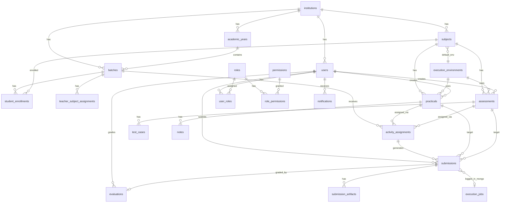

# Entity & Database Schema Reference

> **Purpose:** Complete data model for a **multi-user** virtual practical laboratory platform. Defines every entity, storage type (SQL / NoSQL / cache / object store), schema, relationships, and indexing for concurrent access at scale.
>
> **Related:** [README.md](./README.md) · [evaluation.md](./evaluation.md)

---

## Table of Contents

1. [Storage architecture overview](#1-storage-architecture-overview)
2. [Entity map (all entities)](#2-entity-map-all-entities)
3. [PostgreSQL entities (SQL)](#3-postgresql-entities-sql)
4. [MongoDB collections (NoSQL)](#4-mongodb-collections-nosql)
5. [Redis keys & queues](#5-redis-keys--queues)
6. [Object storage layout](#6-object-storage-layout)
7. [Entity relationship diagram](#7-entity-relationship-diagram)
8. [Indexes & multi-user considerations](#8-indexes--multi-user-considerations)
9. [Enums reference](#9-enums-reference)

---

## 1. Storage architecture overview

| Store | Type | What goes here | Why |
|-------|------|----------------|-----|
| **PostgreSQL** | SQL (primary) | Users, RBAC, subjects, practicals, assessments, submissions, marks, assignments | ACID transactions, relational integrity, complex queries for dashboards |
| **MongoDB** | NoSQL (document) | Execution job logs, raw container output, debug traces | High write volume, flexible schema, append-heavy logs |
| **Redis** | In-memory | JWT blacklist, rate limits, BullMQ job queues, hot cache | Speed, pub/sub, queue backend for concurrent runs |
| **MinIO / S3** | Object storage | Code zips, datasets, PDFs, notebooks, plots, SQL dumps | Large blobs; DB stores metadata + URLs only |

### Design principles (multi-user)

- **PostgreSQL is the source of truth** for identity, permissions, grades, and assignments.
- **Tenant isolation:** `institution_id` on core tables (supports multiple colleges on one deployment).
- **No large blobs in SQL** — code in submissions can be TEXT up to ~512 KB; larger submissions use object storage.
- **Submission immutability** — new row per attempt; never overwrite (audit trail).
- **Soft deletes** on teacher-created content (`deleted_at`); hard retention on submissions.

### Practicals & assessments: PostgreSQL or MongoDB?

**Short answer:** Keep **`practicals` and `assessments` in PostgreSQL**. Put **variable subject-specific fields** in a **`metadata JSONB`** column — not a separate MongoDB collection for the whole entity.

| Concern | Why PostgreSQL still wins for the entity |
|---------|------------------------------------------|
| Many relationships | `submissions`, `activity_assignments`, `evaluations`, `notes`, `attachments` all FK to practical/assessment ID |
| Multi-user queries | "All submissions for Batch SE-A, DSA practical #3, due this week" — joins across users, batches, marks |
| ACID | Assign practical + notify 60 students = one transaction |
| RBAC / tenancy | `institution_id`, `created_by`, publish flags — filtered on every API call |
| Assessments + test cases | `test_cases` table FK to `assessments` — relational by nature |

| Concern | Solution (not full MongoDB migration) |
|---------|--------------------------------------|
| Subject-wise metadata differs | **`metadata JSONB`** on `practicals` / `assessments` |
| Long Markdown body | `description TEXT` in PostgreSQL (fine up to ~1 MB); huge bodies → optional MongoDB `activity_content` keyed by UUID |
| DBMS schema files, ML datasets | **`activity_attachments`** + S3 — not embedded in document DB |

**What goes where (per practical):**

```
PostgreSQL (fixed columns — same for all subjects)
  id, subject_id, environment_id, title, max_marks, due_date, language, …

PostgreSQL (metadata JSONB — varies by subject)
  DSA:    { "sample_io": [...], "constraints": "O(n log n)" }
  DBMS:   { "schema_version": "v2", "preseed_script": "s3://…", "allowed_statements": ["SELECT","INSERT"] }
  ML:     { "dataset_ids": ["uuid"], "expected_artifacts": ["confusion_matrix.png"], "notebook_template": "s3://…" }
  OS:     { "sample_input": { "processes": 4, "burst_times": [6,8,7,3] }, "output_hints": "Gantt chart required" }

MongoDB (only if needed later)
  activity_content: { activity_id, rich_body, revision_history }  — optional for CMS-style editing

S3/MinIO
  PDF manuals, CSV datasets, SQL dumps, starter notebooks
```

**When MongoDB alone would hurt:**

```
Teacher dashboard: submissions JOIN users JOIN batches WHERE practical_id = ?
  → Cross-database join or application-level merge = slow and fragile

Student: "Is this practical still open for my batch?"
  → Needs activity_assignments + practical in one query
```

See [Section 3.13](#313-practicals) — `metadata JSONB` added to schema below.

---

## 2. Entity map (all entities)

| # | Entity | Store | Description |
|---|--------|-------|-------------|
| 1 | `institutions` | PostgreSQL | College / organization (multi-tenant root) |
| 2 | `academic_years` | PostgreSQL | e.g. 2025–26, Sem I / Sem II |
| 3 | `batches` | PostgreSQL | Division / section (e.g. SE-A, TE-B) |
| 4 | `subjects` | PostgreSQL | DSA, OOP, OS, DBMS, ML, DL, DS |
| 5 | `roles` | PostgreSQL | student, teacher, admin |
| 6 | `permissions` | PostgreSQL | Granular actions (create_practical, grade_submission, …) |
| 7 | `role_permissions` | PostgreSQL | Role ↔ permission mapping |
| 8 | `users` | PostgreSQL | All platform users |
| 9 | `user_roles` | PostgreSQL | User ↔ role (scoped by institution/batch) |
| 10 | `teacher_subject_assignments` | PostgreSQL | Teacher teaches subject for batch/year |
| 11 | `student_enrollments` | PostgreSQL | Student in batch + enrolled subjects |
| 12 | `execution_environments` | PostgreSQL | Docker image config per language/subject |
| 13 | `practicals` | PostgreSQL | Regular lab assignments |
| 14 | `assessments` | PostgreSQL | Test-case-based exams |
| 15 | `test_cases` | PostgreSQL | Assessment test cases only |
| 16 | `activity_assignments` | PostgreSQL | Practical or assessment → batch |
| 17 | `activity_attachments` | PostgreSQL | File metadata (manuals, datasets) |
| 18 | `submissions` | PostgreSQL | Student run/submit records |
| 19 | `submission_artifacts` | PostgreSQL | Plots, notebooks, multi-file refs |
| 20 | `evaluations` | PostgreSQL | Teacher marks & feedback |
| 21 | `notes` | PostgreSQL | Student lab journal notes |
| 22 | `notifications` | PostgreSQL | In-app notifications |
| 23 | `refresh_tokens` | PostgreSQL | JWT refresh token store |
| 24 | `audit_logs` | PostgreSQL | Admin/security audit trail |
| 25 | `execution_jobs` | MongoDB | Detailed execution pipeline logs |
| 26 | `application_logs` | MongoDB | API errors, worker traces (optional) |
| 27 | Redis keys | Redis | Sessions, rate limits, cache |
| 28 | BullMQ queues | Redis | `execution:run`, `execution:submit` |
| 29 | Object files | S3/MinIO | Binary file storage |

---

## 3. PostgreSQL entities (SQL)

### 3.1 `institutions`

Multi-tenant root. One row per college / organization.

```sql
CREATE TABLE institutions (
  id              UUID PRIMARY KEY DEFAULT gen_random_uuid(),
  name            VARCHAR(255) NOT NULL,
  code            VARCHAR(50)  NOT NULL UNIQUE,  -- e.g. "PCCOE"
  domain          VARCHAR(255),                   -- optional email domain restriction
  logo_url        TEXT,
  settings        JSONB NOT NULL DEFAULT '{}',    -- timezone, max_submissions_per_day, etc.
  is_active       BOOLEAN NOT NULL DEFAULT TRUE,
  created_at      TIMESTAMPTZ NOT NULL DEFAULT NOW(),
  updated_at      TIMESTAMPTZ NOT NULL DEFAULT NOW()
);
```

---

### 3.2 `academic_years`

```sql
CREATE TABLE academic_years (
  id              UUID PRIMARY KEY DEFAULT gen_random_uuid(),
  institution_id  UUID NOT NULL REFERENCES institutions(id) ON DELETE CASCADE,
  label           VARCHAR(50) NOT NULL,           -- "2025-26"
  year_number     SMALLINT NOT NULL,              -- 2 = SE, 3 = TE
  semester        SMALLINT NOT NULL,              -- 1 or 2
  start_date      DATE,
  end_date        DATE,
  is_current      BOOLEAN NOT NULL DEFAULT FALSE,
  created_at      TIMESTAMPTZ NOT NULL DEFAULT NOW(),

  UNIQUE (institution_id, label, semester)
);
```

---

### 3.3 `batches`

Class divisions within an academic year.

```sql
CREATE TABLE batches (
  id                UUID PRIMARY KEY DEFAULT gen_random_uuid(),
  institution_id    UUID NOT NULL REFERENCES institutions(id) ON DELETE CASCADE,
  academic_year_id  UUID NOT NULL REFERENCES academic_years(id) ON DELETE CASCADE,
  name              VARCHAR(100) NOT NULL,        -- "SE-A", "TE-B"
  code              VARCHAR(50)  NOT NULL,        -- "SE-A-2025"
  strength          INT,                          -- optional student count
  is_active         BOOLEAN NOT NULL DEFAULT TRUE,
  created_at        TIMESTAMPTZ NOT NULL DEFAULT NOW(),
  updated_at        TIMESTAMPTZ NOT NULL DEFAULT NOW(),

  UNIQUE (institution_id, code)
);
```

---

### 3.4 `subjects`

Catalog of lab subjects (shared or per institution).

```sql
CREATE TABLE subjects (
  id                UUID PRIMARY KEY DEFAULT gen_random_uuid(),
  institution_id    UUID REFERENCES institutions(id) ON DELETE CASCADE,  -- NULL = global template
  code              VARCHAR(20) NOT NULL,       -- "DSA", "DBMS"
  name              VARCHAR(255) NOT NULL,
  description       TEXT,
  default_env_id    UUID,                       -- FK → execution_environments (set after seed)
  is_active         BOOLEAN NOT NULL DEFAULT TRUE,
  created_at        TIMESTAMPTZ NOT NULL DEFAULT NOW(),
  updated_at        TIMESTAMPTZ NOT NULL DEFAULT NOW(),

  UNIQUE (institution_id, code)
);
```

---

### 3.5 `roles`

```sql
CREATE TABLE roles (
  id          UUID PRIMARY KEY DEFAULT gen_random_uuid(),
  name        VARCHAR(50) NOT NULL UNIQUE,        -- student | teacher | admin
  description TEXT,
  created_at  TIMESTAMPTZ NOT NULL DEFAULT NOW()
);

-- Seed: student, teacher, admin
```

---

### 3.6 `permissions`

```sql
CREATE TABLE permissions (
  id          UUID PRIMARY KEY DEFAULT gen_random_uuid(),
  code        VARCHAR(100) NOT NULL UNIQUE,     -- practical.create, submission.grade
  description TEXT,
  created_at  TIMESTAMPTZ NOT NULL DEFAULT NOW()
);
```

**Suggested permission codes:**

| Code | Role(s) |
|------|---------|
| `user.manage` | admin |
| `subject.manage` | admin |
| `practical.create` | teacher, admin |
| `practical.assign` | teacher, admin |
| `assessment.create` | teacher, admin |
| `submission.view_all` | teacher, admin |
| `submission.view_own` | student |
| `submission.grade` | teacher, admin |
| `execution.run` | student |
| `analytics.view` | teacher, admin |

---

### 3.7 `role_permissions`

```sql
CREATE TABLE role_permissions (
  role_id       UUID NOT NULL REFERENCES roles(id) ON DELETE CASCADE,
  permission_id UUID NOT NULL REFERENCES permissions(id) ON DELETE CASCADE,
  PRIMARY KEY (role_id, permission_id)
);
```

---

### 3.8 `users`

Central identity table for all concurrent users.

```sql
CREATE TABLE users (
  id              UUID PRIMARY KEY DEFAULT gen_random_uuid(),
  institution_id  UUID NOT NULL REFERENCES institutions(id) ON DELETE CASCADE,
  email           VARCHAR(255) NOT NULL,
  password_hash   VARCHAR(255) NOT NULL,
  first_name      VARCHAR(100) NOT NULL,
  last_name       VARCHAR(100) NOT NULL,
  roll_number     VARCHAR(50),                  -- students
  avatar_url      TEXT,
  phone           VARCHAR(20),
  is_active       BOOLEAN NOT NULL DEFAULT TRUE,
  email_verified  BOOLEAN NOT NULL DEFAULT FALSE,
  last_login_at   TIMESTAMPTZ,
  created_at      TIMESTAMPTZ NOT NULL DEFAULT NOW(),
  updated_at      TIMESTAMPTZ NOT NULL DEFAULT NOW(),

  UNIQUE (institution_id, email),
  UNIQUE (institution_id, roll_number)
);

CREATE INDEX idx_users_institution ON users(institution_id);
CREATE INDEX idx_users_email ON users(email);
```

---

### 3.9 `user_roles`

User may have one primary role; scope can include batch for teachers.

```sql
CREATE TABLE user_roles (
  id              UUID PRIMARY KEY DEFAULT gen_random_uuid(),
  user_id         UUID NOT NULL REFERENCES users(id) ON DELETE CASCADE,
  role_id         UUID NOT NULL REFERENCES roles(id) ON DELETE CASCADE,
  institution_id  UUID NOT NULL REFERENCES institutions(id) ON DELETE CASCADE,
  batch_id        UUID REFERENCES batches(id) ON DELETE SET NULL,  -- optional scope
  assigned_at     TIMESTAMPTZ NOT NULL DEFAULT NOW(),

  UNIQUE (user_id, role_id, batch_id)
);

CREATE INDEX idx_user_roles_user ON user_roles(user_id);
```

---

### 3.10 `teacher_subject_assignments`

Which teacher handles which subject for a batch in a given year.

```sql
CREATE TABLE teacher_subject_assignments (
  id                UUID PRIMARY KEY DEFAULT gen_random_uuid(),
  teacher_id        UUID NOT NULL REFERENCES users(id) ON DELETE CASCADE,
  subject_id        UUID NOT NULL REFERENCES subjects(id) ON DELETE CASCADE,
  batch_id          UUID NOT NULL REFERENCES batches(id) ON DELETE CASCADE,
  academic_year_id  UUID NOT NULL REFERENCES academic_years(id) ON DELETE CASCADE,
  assigned_at       TIMESTAMPTZ NOT NULL DEFAULT NOW(),

  UNIQUE (teacher_id, subject_id, batch_id, academic_year_id)
);

CREATE INDEX idx_tsa_teacher ON teacher_subject_assignments(teacher_id);
CREATE INDEX idx_tsa_batch_subject ON teacher_subject_assignments(batch_id, subject_id);
```

---

### 3.11 `student_enrollments`

Links students to batch and subjects.

```sql
CREATE TABLE student_enrollments (
  id                UUID PRIMARY KEY DEFAULT gen_random_uuid(),
  student_id        UUID NOT NULL REFERENCES users(id) ON DELETE CASCADE,
  batch_id          UUID NOT NULL REFERENCES batches(id) ON DELETE CASCADE,
  subject_id        UUID NOT NULL REFERENCES subjects(id) ON DELETE CASCADE,
  academic_year_id  UUID NOT NULL REFERENCES academic_years(id) ON DELETE CASCADE,
  enrolled_at       TIMESTAMPTZ NOT NULL DEFAULT NOW(),
  is_active         BOOLEAN NOT NULL DEFAULT TRUE,

  UNIQUE (student_id, subject_id, academic_year_id)
);

CREATE INDEX idx_enrollment_student ON student_enrollments(student_id);
CREATE INDEX idx_enrollment_batch ON student_enrollments(batch_id, subject_id);
```

---

### 3.12 `execution_environments`

Docker execution environment definitions — the **reference environments** per subject/language.

```sql
CREATE TABLE execution_environments (
  id                UUID PRIMARY KEY DEFAULT gen_random_uuid(),
  name              VARCHAR(100) NOT NULL,      -- "Jupyter ML Stack"
  slug              VARCHAR(50)  NOT NULL UNIQUE, -- one slug = one Docker image (bundles all components)
  docker_image      VARCHAR(255) NOT NULL,        -- vpl-jupyter-ml:1.0
  language          VARCHAR(30)  NOT NULL,        -- cpp | python | sql | java
  subjects          TEXT[] NOT NULL DEFAULT '{}', -- {ML} or {DSA,OOP,OS}
  description       TEXT,
  components        JSONB NOT NULL DEFAULT '{}',  -- runtime, tools, libraries inside image (see execution.md)
  phase             SMALLINT NOT NULL DEFAULT 1,  -- 1 = Phase 1 delivery
  image_size_mb     INT,
  default_time_limit_sec   INT NOT NULL DEFAULT 30,
  default_memory_limit_mb  INT NOT NULL DEFAULT 512,
  default_cpu_limit        DECIMAL(3,1) DEFAULT 1.0,
  supports_notebook BOOLEAN NOT NULL DEFAULT FALSE,
  supports_multi_file BOOLEAN NOT NULL DEFAULT FALSE,
  network_disabled  BOOLEAN NOT NULL DEFAULT TRUE,
  setup_script      TEXT,
  run_command_template TEXT,
  env_vars          JSONB NOT NULL DEFAULT '{}',
  is_active         BOOLEAN NOT NULL DEFAULT TRUE,
  created_at        TIMESTAMPTZ NOT NULL DEFAULT NOW(),
  updated_at        TIMESTAMPTZ NOT NULL DEFAULT NOW()
);
```

> **Slug vs components:** One `slug` = one pre-built Docker image. ML needs Jupyter + Python + scikit-learn — all are **components inside** `jupyter-ml`, not separate slugs. See [execution.md](./execution.md).

**Seed slugs (Phase 1 → Phase 2):**

| slug | docker_image | subjects | phase |
|------|--------------|----------|-------|
| `cpp-gcc` | `vpl-cpp-runner:1.0` | DSA (C++), OOP, OS | 1 |
| `python-dsa` | `vpl-python-dsa:1.0` | DSA (Python) | 1 |
| `postgres-dbms` | `vpl-postgres-runner:1.0` | DBMS | 1 |
| `jupyter-ml` | `vpl-jupyter-ml:1.0` | ML | 1 |
| `jupyter-ds` | `vpl-jupyter-ds:1.0` | DS | 2 |
| `jupyter-dl` | `vpl-jupyter-dl:1.0` | DL | 2 |

Add FK on subjects after seed:

```sql
ALTER TABLE subjects
  ADD CONSTRAINT fk_subjects_default_env
  FOREIGN KEY (default_env_id) REFERENCES execution_environments(id);
```

---

### 3.13 `practicals`

Regular lab assignments — **no test cases**.

```sql
CREATE TABLE practicals (
  id                UUID PRIMARY KEY DEFAULT gen_random_uuid(),
  institution_id    UUID NOT NULL REFERENCES institutions(id) ON DELETE CASCADE,
  subject_id        UUID NOT NULL REFERENCES subjects(id) ON DELETE RESTRICT,
  environment_id    UUID NOT NULL REFERENCES execution_environments(id) ON DELETE RESTRICT,
  created_by        UUID NOT NULL REFERENCES users(id) ON DELETE RESTRICT,
  title             VARCHAR(500) NOT NULL,
  slug              VARCHAR(200) NOT NULL,
  description       TEXT NOT NULL,              -- Markdown
  instructions      TEXT,
  difficulty        VARCHAR(20),                -- easy | medium | hard
  max_marks         DECIMAL(5,2) NOT NULL DEFAULT 10,
  language          VARCHAR(30) NOT NULL,       -- override env default if needed
  starter_code      TEXT,
  metadata          JSONB NOT NULL DEFAULT '{}',  -- subject-specific variable fields (see design note above)
  time_limit_sec    INT,                        -- NULL = use env default
  memory_limit_mb   INT,
  max_code_size_kb  INT DEFAULT 512,
  allow_multiple_submissions BOOLEAN NOT NULL DEFAULT TRUE,
  max_submissions   INT,                        -- NULL = unlimited
  is_published      BOOLEAN NOT NULL DEFAULT FALSE,
  published_at      TIMESTAMPTZ,
  deleted_at        TIMESTAMPTZ,                -- soft delete
  created_at        TIMESTAMPTZ NOT NULL DEFAULT NOW(),
  updated_at        TIMESTAMPTZ NOT NULL DEFAULT NOW(),

  UNIQUE (institution_id, subject_id, slug)
);

CREATE INDEX idx_practicals_subject ON practicals(subject_id) WHERE deleted_at IS NULL;
CREATE INDEX idx_practicals_created_by ON practicals(created_by);
CREATE INDEX idx_practicals_metadata ON practicals USING GIN (metadata);
```

**Example `metadata` by subject:**

```json
// DSA
{ "sample_io": [{ "input": "5\\n1 2 3 4 5", "output": "15" }], "complexity_note": "O(n)" }

// DBMS
{ "preseed_storage_key": "practicals/uuid/schema.sql", "show_schema_browser": true }

// ML
{ "dataset_attachment_ids": ["uuid"], "submission_mode": "notebook", "required_outputs": ["metrics", "plot"] }

// OS
{ "default_input": { "algorithm": "FCFS", "burst_times": [6, 8, 7, 3] } }
```

---

### 3.14 `assessments`

Test-case-based evaluations (LeetCode-style).

```sql
CREATE TABLE assessments (
  id                UUID PRIMARY KEY DEFAULT gen_random_uuid(),
  institution_id    UUID NOT NULL REFERENCES institutions(id) ON DELETE CASCADE,
  subject_id        UUID NOT NULL REFERENCES subjects(id) ON DELETE RESTRICT,
  environment_id    UUID NOT NULL REFERENCES execution_environments(id) ON DELETE RESTRICT,
  created_by        UUID NOT NULL REFERENCES users(id) ON DELETE RESTRICT,
  title             VARCHAR(500) NOT NULL,
  slug              VARCHAR(200) NOT NULL,
  description       TEXT NOT NULL,
  constraints       TEXT,                         -- time/space complexity notes
  max_marks         DECIMAL(5,2) NOT NULL DEFAULT 10,
  language          VARCHAR(30) NOT NULL,
  starter_code      TEXT,
  metadata          JSONB NOT NULL DEFAULT '{}',  -- subject-specific fields (assessment extras beyond test_cases)
  time_limit_sec    INT NOT NULL DEFAULT 5,       -- per test case
  memory_limit_mb   INT NOT NULL DEFAULT 256,
  max_attempts      INT DEFAULT 1,              -- exam attempts allowed
  passing_score_pct DECIMAL(5,2),               -- optional pass threshold
  is_published      BOOLEAN NOT NULL DEFAULT FALSE,
  deleted_at        TIMESTAMPTZ,
  created_at        TIMESTAMPTZ NOT NULL DEFAULT NOW(),
  updated_at        TIMESTAMPTZ NOT NULL DEFAULT NOW(),

  UNIQUE (institution_id, subject_id, slug)
);

CREATE INDEX idx_assessments_subject ON assessments(subject_id) WHERE deleted_at IS NULL;
CREATE INDEX idx_assessments_metadata ON assessments USING GIN (metadata);
```

---

### 3.15 `test_cases`

**Assessment only.** Sample (visible) and hidden cases.

```sql
CREATE TABLE test_cases (
  id                UUID PRIMARY KEY DEFAULT gen_random_uuid(),
  assessment_id     UUID NOT NULL REFERENCES assessments(id) ON DELETE CASCADE,
  sort_order        INT NOT NULL DEFAULT 0,
  label             VARCHAR(100),               -- "Sample 1", "Hidden 3"
  input             TEXT NOT NULL,
  expected_output   TEXT NOT NULL,
  is_sample         BOOLEAN NOT NULL DEFAULT FALSE,  -- visible to student on Run
  is_hidden         BOOLEAN NOT NULL DEFAULT TRUE,   -- used on Submit
  points            DECIMAL(5,2) NOT NULL DEFAULT 1,
  comparison_type   VARCHAR(30) NOT NULL DEFAULT 'exact',
                    -- exact | trim_lines | numeric_tolerance | unordered_lines
  tolerance         DECIMAL(10,6) DEFAULT 0,
  time_limit_sec    INT,                        -- override assessment default
  created_at        TIMESTAMPTZ NOT NULL DEFAULT NOW(),

  CHECK (is_sample = TRUE OR is_hidden = TRUE)
);

CREATE INDEX idx_test_cases_assessment ON test_cases(assessment_id, sort_order);
```

---

### 3.16 `activity_assignments`

Assigns a **practical** or **assessment** to a batch with schedule.

```sql
CREATE TYPE activity_type AS ENUM ('practical', 'assessment');

CREATE TABLE activity_assignments (
  id                UUID PRIMARY KEY DEFAULT gen_random_uuid(),
  activity_type     activity_type NOT NULL,
  practical_id      UUID REFERENCES practicals(id) ON DELETE CASCADE,
  assessment_id     UUID REFERENCES assessments(id) ON DELETE CASCADE,
  batch_id          UUID NOT NULL REFERENCES batches(id) ON DELETE CASCADE,
  assigned_by       UUID NOT NULL REFERENCES users(id) ON DELETE RESTRICT,
  opens_at          TIMESTAMPTZ,                -- when students can start
  due_at            TIMESTAMPTZ,
  closes_at         TIMESTAMPTZ,                -- hard deadline
  is_active         BOOLEAN NOT NULL DEFAULT TRUE,
  assigned_at       TIMESTAMPTZ NOT NULL DEFAULT NOW(),

  CHECK (
    (activity_type = 'practical' AND practical_id IS NOT NULL AND assessment_id IS NULL) OR
    (activity_type = 'assessment' AND assessment_id IS NOT NULL AND practical_id IS NULL)
  )
);

CREATE INDEX idx_assignments_batch ON activity_assignments(batch_id, activity_type);
CREATE INDEX idx_assignments_practical ON activity_assignments(practical_id) WHERE practical_id IS NOT NULL;
CREATE INDEX idx_assignments_assessment ON activity_assignments(assessment_id) WHERE assessment_id IS NOT NULL;
CREATE UNIQUE INDEX uq_assignment_practical_batch ON activity_assignments(practical_id, batch_id) WHERE practical_id IS NOT NULL;
CREATE UNIQUE INDEX uq_assignment_assessment_batch ON activity_assignments(assessment_id, batch_id) WHERE assessment_id IS NOT NULL;
```

---

### 3.17 `activity_attachments`

Metadata for files attached to practicals/assessments (blobs in S3).

```sql
CREATE TABLE activity_attachments (
  id                UUID PRIMARY KEY DEFAULT gen_random_uuid(),
  activity_type     activity_type NOT NULL,
  practical_id      UUID REFERENCES practicals(id) ON DELETE CASCADE,
  assessment_id     UUID REFERENCES assessments(id) ON DELETE CASCADE,
  file_name         VARCHAR(255) NOT NULL,
  file_type         VARCHAR(50) NOT NULL,       -- pdf | csv | sql | zip | ipynb
  file_size_bytes   BIGINT NOT NULL,
  storage_key       TEXT NOT NULL,              -- S3 path
  storage_url       TEXT NOT NULL,
  attachment_role   VARCHAR(50) NOT NULL,
                    -- manual | dataset | schema | starter | reference
  uploaded_by       UUID NOT NULL REFERENCES users(id),
  created_at        TIMESTAMPTZ NOT NULL DEFAULT NOW()
);

CREATE INDEX idx_attachments_practical ON activity_attachments(practical_id);
CREATE INDEX idx_attachments_assessment ON activity_attachments(assessment_id);
```

---

### 3.18 `submissions`

Core accountability table — shared fields for both `run` and `submit` events. Assessment-specific auto-grade details are moved to a separate table `assessment_submissions` (see below) to keep concerns separated and queries simple.

```sql
CREATE TYPE submission_type AS ENUM ('run', 'submit');
CREATE TYPE practical_status AS ENUM (
  'submitted', 'executed', 'evaluated',
  'compilation_error', 'runtime_error', 'time_limit_exceeded'
);

CREATE TABLE submissions (
  id                UUID PRIMARY KEY DEFAULT gen_random_uuid(),
  institution_id    UUID NOT NULL REFERENCES institutions(id) ON DELETE CASCADE,
  student_id        UUID NOT NULL REFERENCES users(id) ON DELETE CASCADE,
  activity_type     activity_type NOT NULL,
  practical_id      UUID REFERENCES practicals(id) ON DELETE SET NULL,
  assessment_id     UUID REFERENCES assessments(id) ON DELETE SET NULL,
  assignment_id     UUID REFERENCES activity_assignments(id) ON DELETE SET NULL,
  submission_type   submission_type NOT NULL DEFAULT 'submit',
  attempt_number    INT NOT NULL DEFAULT 1,

  -- Code
  code              TEXT NOT NULL,
  language          VARCHAR(30) NOT NULL,

  -- Execution output (summary stored here; full logs in MongoDB)
  stdout            TEXT,
  stderr            TEXT,
  exit_code         INT,
  exec_time_ms      INT,
  memory_used_kb    INT,

  -- Practical grading (manual)
  practical_status  practical_status,

  -- Final marks (filled after evaluation)
  manual_score      DECIMAL(7,2),
  final_score       DECIMAL(7,2),

  -- Link to MongoDB detailed log
  execution_job_id  VARCHAR(24),                -- MongoDB ObjectId as string

  submitted_at      TIMESTAMPTZ NOT NULL DEFAULT NOW(),

  CHECK (
    (activity_type = 'practical' AND practical_id IS NOT NULL) OR
    (activity_type = 'assessment' AND assessment_id IS NOT NULL)
  )
);

-- Uniqueness: one attempt_number per student + activity.
CREATE UNIQUE INDEX uq_submission_attempt ON submissions(
  student_id, activity_type, COALESCE(practical_id::text, assessment_id::text), attempt_number
);

CREATE INDEX idx_submissions_student ON submissions(student_id, submitted_at DESC);
CREATE INDEX idx_submissions_practical ON submissions(practical_id, student_id);
CREATE INDEX idx_submissions_assessment ON submissions(assessment_id, student_id);
CREATE INDEX idx_submissions_assignment ON submissions(assignment_id);
CREATE INDEX idx_submissions_institution_date ON submissions(institution_id, submitted_at DESC);
```

### 3.18.1 `assessment_submissions`

Assessment-specific auto-grading results and per-test-case details are stored here. This keeps `submissions` lean and avoids nullable/ambiguous columns.

```sql
CREATE TABLE assessment_submissions (
  submission_id  UUID PRIMARY KEY REFERENCES submissions(id) ON DELETE CASCADE,
  auto_score     DECIMAL(7,2),
  test_results   JSONB NOT NULL,            -- array/object per-case results
  status         VARCHAR(32) NOT NULL,     -- accepted|wrong_answer|compilation_error|runtime_error|time_limit_exceeded|partial
  run_metadata   JSONB DEFAULT '{}'::jsonb, -- per-case runtimes/memory if needed
  created_at     TIMESTAMPTZ NOT NULL DEFAULT NOW()
);

CREATE INDEX idx_assess_subm_submission ON assessment_submissions(submission_id);
CREATE INDEX idx_assess_subm_status ON assessment_submissions((status));
CREATE INDEX idx_assess_subm_test_results ON assessment_submissions USING GIN (test_results);
```

**`test_results` JSONB example (assessment):**

```json
[
  {
    "test_case_id": "uuid",
    "label": "Sample 1",
    "passed": true,
    "time_ms": 12,
    "expected_output": "15",
    "actual_output": "15"
  },
  {
    "test_case_id": "uuid",
    "label": "Hidden 2",
    "passed": false,
    "time_ms": 45,
    "expected_output": "100",
    "actual_output": "99"
  }
]
```

### Migration notes (recommended)

1. Create `assessment_submissions` table.
2. Backfill assessment rows from `submissions` into `assessment_submissions`:

```sql
BEGIN;

INSERT INTO assessment_submissions (submission_id, auto_score, test_results, status, run_metadata, created_at)
SELECT id, auto_score, COALESCE(test_results, '[]'::jsonb),
       COALESCE(assessment_status::text, 'partial')::varchar, '{}'::jsonb, submitted_at
FROM submissions
WHERE assessment_id IS NOT NULL AND (test_results IS NOT NULL OR auto_score IS NOT NULL OR assessment_status IS NOT NULL);

-- After verification, remove deprecated columns from `submissions` (do this manually):
-- ALTER TABLE submissions DROP COLUMN assessment_status;
-- ALTER TABLE submissions DROP COLUMN test_results;
-- ALTER TABLE submissions DROP COLUMN auto_score;
-- ALTER TABLE submissions DROP COLUMN max_score;

COMMIT;
```

Keep the deprecated columns for a short verification window before dropping them.


---

### 3.19 `submission_artifacts`

Generated files from execution (plots, notebooks, SQL exports).

```sql
CREATE TABLE submission_artifacts (
  id              UUID PRIMARY KEY DEFAULT gen_random_uuid(),
  submission_id   UUID NOT NULL REFERENCES submissions(id) ON DELETE CASCADE,
  file_name       VARCHAR(255) NOT NULL,
  file_type       VARCHAR(50) NOT NULL,         -- png | ipynb | csv | h5 | zip
  file_size_bytes BIGINT NOT NULL,
  storage_key     TEXT NOT NULL,
  storage_url     TEXT NOT NULL,
  artifact_type   VARCHAR(50) NOT NULL,         -- plot | notebook | model | output_file
  created_at      TIMESTAMPTZ NOT NULL DEFAULT NOW()
);

CREATE INDEX idx_artifacts_submission ON submission_artifacts(submission_id);
```

---

### 3.20 `evaluations`

Teacher grading record (separate from submission for audit history).

```sql
CREATE TABLE evaluations (
  id              UUID PRIMARY KEY DEFAULT gen_random_uuid(),
  submission_id   UUID NOT NULL REFERENCES submissions(id) ON DELETE CASCADE,
  evaluated_by    UUID NOT NULL REFERENCES users(id) ON DELETE RESTRICT,
  manual_score    DECIMAL(7,2) NOT NULL,
  final_score     DECIMAL(7,2) NOT NULL,        -- may equal auto_score or override
  feedback        TEXT,
  rubric_scores   JSONB,                        -- optional: [{criterion, score, max}]
  is_published    BOOLEAN NOT NULL DEFAULT FALSE,
  published_at    TIMESTAMPTZ,
  evaluated_at    TIMESTAMPTZ NOT NULL DEFAULT NOW(),

  UNIQUE (submission_id)                        -- one evaluation per submission (latest)
);
```

---

### 3.21 `notes`

Student lab journal per practical.

```sql
CREATE TABLE notes (
  id              UUID PRIMARY KEY DEFAULT gen_random_uuid(),
  student_id      UUID NOT NULL REFERENCES users(id) ON DELETE CASCADE,
  practical_id    UUID NOT NULL REFERENCES practicals(id) ON DELETE CASCADE,
  content         TEXT NOT NULL,                -- Markdown
  created_at      TIMESTAMPTZ NOT NULL DEFAULT NOW(),
  updated_at      TIMESTAMPTZ NOT NULL DEFAULT NOW(),

  UNIQUE (student_id, practical_id)
);
```

---

### 3.22 `notifications`

In-app notifications for concurrent users.

```sql
CREATE TYPE notification_type AS ENUM (
  'practical_assigned', 'assessment_assigned', 'deadline_reminder',
  'evaluation_published', 'submission_received', 'system'
);

CREATE TABLE notifications (
  id              UUID PRIMARY KEY DEFAULT gen_random_uuid(),
  user_id         UUID NOT NULL REFERENCES users(id) ON DELETE CASCADE,
  type            notification_type NOT NULL,
  title           VARCHAR(255) NOT NULL,
  message         TEXT NOT NULL,
  link            TEXT,                         -- /practicals/uuid
  metadata        JSONB DEFAULT '{}',
  is_read         BOOLEAN NOT NULL DEFAULT FALSE,
  read_at         TIMESTAMPTZ,
  created_at      TIMESTAMPTZ NOT NULL DEFAULT NOW()
);

CREATE INDEX idx_notifications_user_unread ON notifications(user_id, is_read, created_at DESC);
```

---

### 3.23 `refresh_tokens`

Secure refresh token rotation for many concurrent sessions.

```sql
CREATE TABLE refresh_tokens (
  id              UUID PRIMARY KEY DEFAULT gen_random_uuid(),
  user_id         UUID NOT NULL REFERENCES users(id) ON DELETE CASCADE,
  token_hash      VARCHAR(255) NOT NULL UNIQUE,
  device_info     VARCHAR(255),
  ip_address      INET,
  expires_at      TIMESTAMPTZ NOT NULL,
  revoked_at      TIMESTAMPTZ,
  created_at      TIMESTAMPTZ NOT NULL DEFAULT NOW()
);

CREATE INDEX idx_refresh_tokens_user ON refresh_tokens(user_id);
CREATE INDEX idx_refresh_tokens_expires ON refresh_tokens(expires_at) WHERE revoked_at IS NULL;
```

---

### 3.24 `audit_logs`

Security and admin audit trail (SQL for integrity).

```sql
CREATE TABLE audit_logs (
  id              UUID PRIMARY KEY DEFAULT gen_random_uuid(),
  institution_id  UUID REFERENCES institutions(id) ON DELETE SET NULL,
  actor_id        UUID REFERENCES users(id) ON DELETE SET NULL,
  action          VARCHAR(100) NOT NULL,        -- user.role_changed, practical.deleted
  entity_type     VARCHAR(50),                  -- user | practical | submission
  entity_id       UUID,
  old_values      JSONB,
  new_values      JSONB,
  ip_address      INET,
  user_agent      TEXT,
  created_at      TIMESTAMPTZ NOT NULL DEFAULT NOW()
);

CREATE INDEX idx_audit_institution ON audit_logs(institution_id, created_at DESC);
CREATE INDEX idx_audit_actor ON audit_logs(actor_id, created_at DESC);
```

---

## 4. MongoDB collections (NoSQL)

High-volume, append-only data. Not used for transactional grades.

### 4.1 `execution_jobs`

One document per Docker execution (Run or Submit).

```javascript
// Collection: execution_jobs
{
  _id: ObjectId,
  submission_id: "uuid",           // FK to PostgreSQL submissions.id
  institution_id: "uuid",
  student_id: "uuid",
  activity_type: "practical" | "assessment",
  practical_id: "uuid | null",
  assessment_id: "uuid | null",
  environment_slug: "cpp-gcc",

  job_type: "run" | "submit",
  queue_job_id: "bullmq-job-id",
  status: "queued" | "running" | "completed" | "failed" | "timeout",

  container: {
    id: "docker-container-id",
    image: "vpl-cpp-runner:latest",
    hostname: "worker-02"
  },

  resource_limits: {
    cpu: 1.0,
    memory_mb: 512,
    time_limit_sec: 30
  },

  resource_usage: {
    exec_time_ms: 42,
    memory_peak_kb: 8192,
    exit_code: 0
  },

  logs: {
    stdout: "...",
    stderr: "...",
    compile_log: "...",
    runner_log: "..."
  },

  test_execution: [                // assessment only
    {
      test_case_id: "uuid",
      passed: true,
      exec_time_ms: 12,
      stdout: "...",
      stderr: ""
    }
  ],

  error: {
    code: "COMPILATION_ERROR",
    message: "error: expected ';' before '}'"
  },

  started_at: ISODate,
  completed_at: ISODate,
  created_at: ISODate
}
```

**Indexes:**

```javascript
db.execution_jobs.createIndex({ submission_id: 1 });
db.execution_jobs.createIndex({ student_id: 1, created_at: -1 });
db.execution_jobs.createIndex({ status: 1, created_at: -1 });
db.execution_jobs.createIndex({ created_at: 1 }, { expireAfterSeconds: 7776000 }); // 90-day TTL optional
```

---

### 4.2 `application_logs` (optional)

```javascript
// Collection: application_logs
{
  _id: ObjectId,
  level: "error" | "warn" | "info",
  service: "api" | "worker" | "websocket",
  message: "...",
  stack: "...",
  request_id: "uuid",
  user_id: "uuid",
  path: "/api/execution/submit",
  metadata: {},
  created_at: ISODate
}
```

### 4.3 `activity_content` (optional — Phase 2)

Only if practical descriptions become very large or need revision history / collaborative editing. **Not required for Phase 1.**

```javascript
// Collection: activity_content
{
  _id: ObjectId,
  activity_id: "uuid",              // matches PostgreSQL practicals.id or assessments.id
  activity_type: "practical" | "assessment",
  rich_description: "...",          // extended Markdown / block editor JSON
  revision: 3,
  updated_by: "uuid",
  updated_at: ISODate
}
```

PostgreSQL row remains the **authority** for id, subject, marks, publish state. MongoDB holds optional **content overflow** only.

---

## 5. Redis keys & queues

Not relational entities — documented for completeness.

| Key pattern | Type | Purpose | TTL |
|-------------|------|---------|-----|
| `jwt:blacklist:{jti}` | STRING | Revoked access tokens | = token expiry |
| `ratelimit:run:{user_id}` | STRING (counter) | Run requests per minute | 60s |
| `ratelimit:submit:{user_id}` | STRING | Submit requests per minute | 60s |
| `cache:practical:{id}` | STRING (JSON) | Hot practical metadata | 300s |
| `cache:assessment:{id}` | STRING (JSON) | Hot assessment + sample tests | 300s |
| `session:ws:{user_id}` | SET | Active WebSocket connection IDs | — |
| `bull:execution:run` | LIST/ZSET | BullMQ run queue | — |
| `bull:execution:submit` | LIST/ZSET | BullMQ submit queue | — |

---

## 6. Object storage layout

Binary files — metadata in PostgreSQL (`activity_attachments`, `submission_artifacts`).

```
{bucket}/
  institutions/{institution_id}/
    subjects/{subject_id}/manuals/{file_id}_{name}
    practicals/{practical_id}/
      attachments/{file_id}_{name}
      datasets/{file_id}_{name}
    assessments/{assessment_id}/
      attachments/{file_id}_{name}
    submissions/{submission_id}/
      code/{filename}                    # multi-file submissions
      artifacts/{file_id}_{name}       # plots, notebooks, models
```

---

## 7. Entity relationship diagram



---

## 8. Indexes & multi-user considerations

### Concurrent access patterns

| Pattern | Solution |
|---------|----------|
| Many students submit simultaneously | BullMQ queue + horizontal worker scaling |
| Teacher dashboard loads all submissions | Index `(practical_id, student_id)`, paginate |
| Student submission history | Index `(student_id, submitted_at DESC)` |
| Auth on every request | JWT stateless + Redis blacklist for logout |
| Same practical, many batches | `activity_assignments` separates schedule per batch |
| Large stdout/logs | Store summary in PostgreSQL; full logs in MongoDB |

### Recommended PostgreSQL settings (production)

- Connection pooling: **PgBouncer** (transaction mode)
- Read replicas for analytics/reporting queries
- Partition `submissions` by `submitted_at` (monthly) when rows > 10M
- Partition `audit_logs` by month

### Row-level security (optional)

For strict multi-tenant isolation:

```sql
ALTER TABLE submissions ENABLE ROW LEVEL SECURITY;
CREATE POLICY institution_isolation ON submissions
  USING (institution_id = current_setting('app.institution_id')::UUID);
```

---

## 9. Enums reference

### PostgreSQL enums (summary)

| Enum | Values |
|------|--------|
| `activity_type` | `practical`, `assessment` |
| `submission_type` | `run`, `submit` |
| `practical_status` | `submitted`, `executed`, `evaluated`, `compilation_error`, `runtime_error`, `time_limit_exceeded` |
| `assessment_status` | `accepted`, `wrong_answer`, `compilation_error`, `runtime_error`, `time_limit_exceeded`, `partial` |
| `notification_type` | `practical_assigned`, `assessment_assigned`, `deadline_reminder`, `evaluation_published`, `submission_received`, `system` |

### Execution environment slugs (seed data)

> Full component lists per slug: [execution.md](./execution.md)

| slug | docker_image | language | subjects | phase |
|------|--------------|----------|----------|-------|
| `cpp-gcc` | `vpl-cpp-runner:1.0` | cpp | DSA, OOP, OS | 1 |
| `python-dsa` | `vpl-python-dsa:1.0` | python | DSA | 1 |
| `postgres-dbms` | `vpl-postgres-runner:1.0` | sql | DBMS | 1 |
| `jupyter-ml` | `vpl-jupyter-ml:1.0` | python | ML | 1 |
| `jupyter-ds` | `vpl-jupyter-ds:1.0` | python | DS | 2 |
| `jupyter-dl` | `vpl-jupyter-dl:1.0` | python | DL | 2 |

---

## Appendix — Entity count summary

| Store | Entity count |
|-------|--------------|
| PostgreSQL | **24 tables** |
| MongoDB | **2 collections** |
| Redis | **7 key patterns + 2 queues** |
| S3/MinIO | **4 path conventions** |

---

*Last updated: August 2026 — aligned with Practical vs Assessment model in [evaluation.md](./evaluation.md).*
