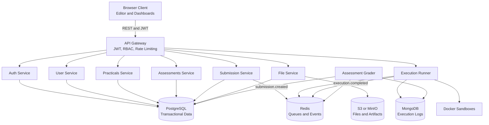
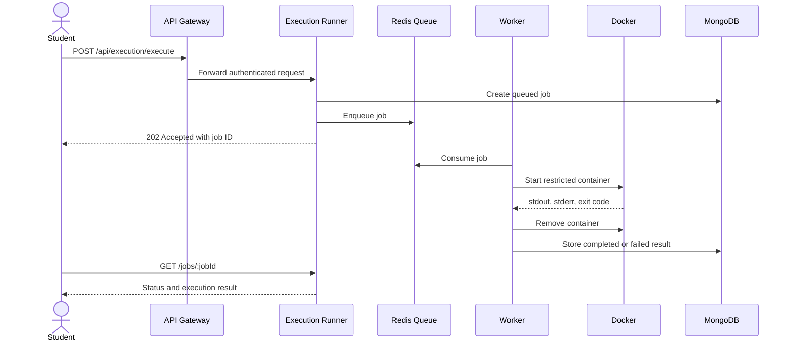

# AI-Powered Virtual Practical Laboratory System

> An interview-ready guide for explaining the project clearly, technically, and honestly.

## 1. One-Minute Introduction

**AI-Powered Virtual Practical Laboratory System** is a browser-based platform for conducting and managing computer engineering practicals. It allows teachers to publish assignments and assessments, students to write code in an online editor, and the platform to execute that code in isolated Docker containers.

The system is designed around three important requirements:

1. **A consistent lab environment:** students do not need to install different compilers, databases, or machine-learning libraries locally.
2. **Safe execution:** student code runs in short-lived, resource-limited containers rather than directly on the application server.
3. **Accountability:** runs, submissions, outputs, grades, and feedback are stored as a history instead of being overwritten.

The base model uses a Node.js and TypeScript microservice architecture. It supports regular practicals, where teachers manually review code and output, as well as assessments, where submissions are evaluated against visible and hidden test cases. The AI features suggested by the name, such as chatbot assistance, RAG, and AI-based evaluation, are planned for a later phase; the current foundation focuses on reliable execution, assessment, and management workflows.

## 2. Short Elevator Pitch

> I worked on a virtual practical laboratory platform that lets students write and run code from a browser while giving teachers a complete workflow for creating assignments, collecting submissions, and evaluating them. The interesting engineering problem was executing untrusted code safely and consistently across C++, Python, machine-learning, deep-learning, and SQL environments. We addressed that with a service-oriented backend, Redis-backed asynchronous jobs, Docker sandboxes with CPU, memory, timeout, and network restrictions, PostgreSQL for transactional data, MongoDB for execution logs, and S3-compatible storage for larger files.

## 3. The Problem

Traditional practical laboratories have several recurring problems:

- Students have different operating systems, compiler versions, and library installations.
- Teachers spend significant time collecting files and checking whether programs actually ran.
- A server that executes student code directly can be exposed to resource exhaustion or malicious behavior.
- Regular practicals and exam-style coding assessments need different evaluation models.
- Submission history, execution output, marks, and feedback are often spread across systems or lost after resubmission.

This project addresses those issues through a centralized browser experience and a controlled execution pipeline.

## 4. Users and Main Workflows

### Student

- View assigned practicals and assessments.
- Read instructions and starter material.
- Write code in an integrated editor.
- Run code with sample input.
- Submit a version for evaluation.
- View execution output, history, marks, and feedback.

### Teacher

- Create practical assignments and attach files or datasets.
- Configure the required execution environment.
- Create timed assessments with visible and hidden test cases.
- Review practical submissions manually.
- Inspect assessment results and override marks when required.
- Export records for academic use.

### Administrator

- Manage users, roles, subjects, batches, and platform settings.
- Monitor usage and audit sensitive actions.

## 5. Practical Versus Assessment

This distinction is one of the most important product decisions in the project.

| Area | Practical | Assessment |
|---|---|---|
| Purpose | Regular laboratory work | Exam or coding challenge |
| Execution | Capture output and artifacts | Run against test cases |
| Grading | Teacher reviews code and output | Automatic score, with teacher override |
| Output | Console, SQL grid, plots, or notebook artifacts | Per-test-case pass/fail and aggregate score |
| Examples | OOP, OS, DBMS, ML, DL, and DS labs | Timed DSA problem with hidden tests |

A practical is not forced into an online-judge model. This matters for subjects such as DBMS, ML, and DL, where correctness can include queries, charts, model artifacts, observations, and code quality rather than only one exact output.

## 6. High-Level Architecture

### Service responsibilities

| Service | Responsibility |
|---|---|
| `api-gateway` | Single public entry point, routing, request tracing, rate limiting, and authentication forwarding |
| `auth-service` | Registration, password hashing, login, JWT signing, refresh tokens, and token introspection |
| `user-service` | Profiles, roles, batches, and enrollments |
| `practicals-service` | Regular practical assignment management and environment metadata |
| `assessments-service` | Timed assessments and visible or hidden test cases |
| `submission-service` | Versioned submissions, anti-spam checks, and submission events |
| `execution-runner` | Queue consumption, Docker lifecycle, output capture, timeouts, and artifacts |
| `assessment-grader` | Test-case comparison, score calculation, and grading events |
| `file-service` | Presigned S3/MinIO upload and download URLs plus attachment metadata |

## 7. End-to-End: Student Runs Code

A good way to explain the project is to follow one request.

1. The student sends code, the selected environment, standard input, and resource limits to the API Gateway.
2. The Gateway authenticates the request and forwards it to the Execution Runner.
3. The Runner creates a job record in MongoDB and places a job on the Redis queue.
4. A worker takes the job from the queue and creates a temporary workspace.
5. The worker starts the appropriate Docker image with a disabled network, CPU and memory limits, and a timeout.
6. The container compiles or runs the code and produces stdout, stderr, exit code, execution time, and optional artifacts.
7. The worker destroys the temporary container and updates the job record.
8. The Runner publishes an `execution.completed` event.
9. The client can poll for the job status, or a future WebSocket layer can stream updates.

## 8. End-to-End: Assessment Submission

1. A teacher creates an assessment and stores its test cases in PostgreSQL.
2. Visible tests are shown to the student; hidden tests remain server-side.
3. The student submits code through the Submission Service.
4. The submission is stored as an immutable attempt and an event is published.
5. The Execution Runner executes the submission in the selected sandbox.
6. The Assessment Grader consumes `execution.completed`.
7. The Grader fetches the submission and test-case definitions, compares results, calculates the score, and stores per-test-case results.
8. A `grading.completed` event makes the result available to the application.

The important design point is that grading is asynchronous. The API does not need to hold an HTTP request open while a potentially expensive or queued job runs.

## 9. Execution Environments

The platform uses consolidated images instead of creating one image for every library.

| Environment | Subjects | Main contents |
|---|---|---|
| `cpp-gcc` | DSA, OOP, OS | GCC, G++, `make`, pthread, Bash, and core utilities |
| `python-dl` | Python DSA, ML, DL, DS | Python 3.11, PyTorch, NumPy, Pandas, scikit-learn, Matplotlib, Seaborn, and SciPy |
| `postgres-dbms` | DBMS | PostgreSQL 16, `psql`, and a Python query runner that returns structured JSON grids |

A practical stores an environment reference. The execution orchestrator uses that reference to select the Docker image and command template. This keeps subject configuration in data rather than hard-coding it into every request.

## 10. Data Storage Decisions

### PostgreSQL: source of truth

PostgreSQL stores data that needs relationships, constraints, transactions, and reliable reporting:

- Users, roles, institutions, and batches
- Subjects and practicals
- Assessments and test cases
- Assignments and enrollments
- Submission metadata and evaluations
- Audit records and attachment metadata

### MongoDB: execution and operational logs

Execution jobs and raw container output are append-heavy and can have different fields depending on the environment. MongoDB is a good fit for these logs without weakening the relational model used for grades and permissions.

### Redis: queues and fast coordination

Redis supports the execution queue, pub/sub events, rate limits, and selected cache data. It also decouples the API request from the worker that performs the execution.

### S3 or MinIO: large files

Datasets, PDFs, notebooks, plots, and larger artifacts are stored as objects. The database stores metadata and object keys, while presigned URLs allow clients to upload or download without routing large binary data through the application server.

## 11. Security and Reliability

The execution boundary is the most security-sensitive part of the system.

- **Container isolation:** student code runs in a short-lived Docker container.
- **No outbound network:** prevents code from contacting external services or exfiltrating data.
- **Resource limits:** CPU, memory, and execution time prevent runaway programs from exhausting the host.
- **Temporary workspaces:** files are isolated per job and removed after execution.
- **JWT and RBAC:** API access is based on authenticated identity and role permissions.
- **Hidden test cases:** assessment data required for grading is never sent to the student client.
- **Immutable submissions:** every attempt is preserved for auditability and dispute resolution.
- **Rate limiting and queues:** protect the API and make execution fair when many students run code together.
- **Audit logging:** sensitive administrative operations can be traced.

In a production deployment, I would additionally run the execution layer on dedicated worker nodes, avoid exposing the Docker socket to general application services, use stronger container or VM isolation where appropriate, scan uploaded files, and add centralized metrics and alerting.

## 12. Important Engineering Trade-offs

### Why microservices?

The execution runner has very different operational risks from authentication or assignment management. Separating services lets the execution worker scale independently and limits the blast radius of failures. The trade-off is higher deployment, observability, and local-development complexity.

### Why both PostgreSQL and MongoDB?

Using PostgreSQL for all data would simplify infrastructure, but execution logs are high-volume, append-oriented, and environment-specific. Using MongoDB for core entities would make relationships, permissions, grading, and reporting more difficult. Each store is used for the workload it handles best.

### Why Redis queues instead of synchronous execution?

Synchronous execution makes the API fragile under load and causes long-running requests. A queue provides backpressure, worker scaling, retry opportunities, and a clear separation between accepting work and performing work.

### Why immutable submissions?

Overwriting a student’s previous submission loses the evidence needed for grading discussions and debugging. A new row per attempt makes history explicit and supports comparison between versions.

### Why separate practicals and assessments?

A regular practical can require subjective review and rich artifacts. An assessment needs deterministic test cases and automatic scoring. Combining both into one evaluation model would make one of the workflows unnecessarily rigid.

## 13. A Strong Interview Walkthrough

Use this order in a project discussion:

1. **Start with the problem:** inconsistent lab setups, manual evaluation, and unsafe code execution.
2. **State the product:** browser-based assignments, editor, submissions, execution, and grading.
3. **Draw the architecture:** Gateway -> services -> queue -> worker -> Docker -> storage.
4. **Explain one run request:** queued, sandboxed, captured, persisted, and reported.
5. **Explain the assessment variation:** hidden tests and asynchronous auto-grading.
6. **Discuss security:** network isolation, resource limits, timeouts, RBAC, and immutable history.
7. **Defend the storage choices:** PostgreSQL for truth, MongoDB for logs, Redis for coordination, object storage for files.
8. **Acknowledge scope:** the platform foundation is the current focus; AI-assisted features are a later phase.

## 14. Demo Script

A concise demo can follow this sequence:

1. Log in as a teacher and create a practical.
2. Select an environment such as `cpp-gcc` or `postgres-dbms`.
3. Attach a dataset or SQL schema through the file workflow.
4. Log in as a student and open the assignment.
5. Run code and show the queued job and captured output.
6. Submit the attempt and show that it is stored as a new version.
7. Open the teacher view and review code, output, and marks.
8. Show an assessment with sample tests and explain that hidden tests remain on the server.
9. Point out the Docker runner and its resource restrictions.

## 15. Likely Interview Questions and Answers

### What was the hardest part?

The hardest part was designing a safe and predictable execution pipeline for multiple runtimes. It is not enough to run a child process; the system must isolate files and networking, enforce resource limits, handle compilation and runtime failures, clean up containers, and persist useful output for later review.

### How do you prevent one student from affecting another?

Each execution gets its own short-lived container and workspace. The container has no outbound network, fixed CPU and memory limits, and a timeout. It is removed after completion or failure, so processes and files do not leak into another job.

### What happens if many students click Run at once?

The API accepts jobs and places them on Redis rather than executing them inline. Workers consume jobs at a controlled rate. This provides backpressure and allows the worker pool to scale separately from the API.

### Why is PostgreSQL the primary database?

The core model has many relationships: users, roles, batches, assignments, submissions, test cases, and evaluations. PostgreSQL gives us foreign keys, transactions, constraints, and reporting queries needed for academic workflows.

### How does automatic grading work?

The grader consumes an execution-completed event, loads the assessment’s test cases and the student submission, compares actual and expected results according to the configured rules, calculates the aggregate score, stores per-test-case outcomes, and publishes a grading-completed event.

### Is this really an AI project?

The current release is the platform foundation rather than an AI feature release. The architecture intentionally leaves room for later chatbot, RAG, vector-search, and AI-assisted evaluation features. The current work solves the more fundamental problems of identity, execution, storage, isolation, and assessment management.

### What would you improve next?

I would add stronger production-grade sandbox isolation, centralized metrics and tracing, worker autoscaling, retry and dead-letter policies, comprehensive integration tests, and the planned AI assistance layer with clear academic-integrity controls.

## 16. Project Status and Honest Framing

The repository contains the service structure, database migrations, Docker runner environments, execution runner, assessment grader, shared libraries, architecture documentation, and execution tests. Some frontend and broader platform capabilities are represented in the planned architecture and roadmap rather than being presented as fully shipped functionality.

A good phrase to use in an interview is:

> The project is being developed incrementally. The current foundation focuses on the backend service boundaries and secure execution pipeline, while the complete product architecture also defines authentication, practical management, submissions, assessments, file handling, and future AI capabilities.

## 17. Closing Summary

This project is more than an online code editor. It is an academic workflow platform with:

- Role-aware assignment and assessment management
- Multiple subject-specific execution environments
- Queue-backed, Docker-isolated code execution
- Automatic assessment grading and manual practical review
- Transactional academic data and separate execution-log storage
- Immutable submission history and auditability

The strongest technical story is the boundary between the web application and untrusted code: requests are authenticated, queued, executed in a restricted environment, recorded, and evaluated without allowing arbitrary student programs to run directly on the host.
