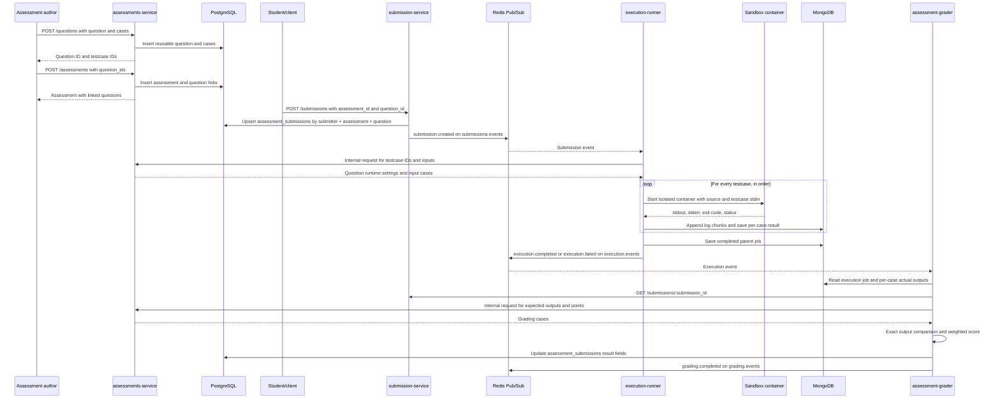

# Judge0-Style Assessment Workflow

This guide describes how the four services collaborate to create a multi-question assessment, execute one question against all of its test cases, and store a per-case grade. It documents the current implementation in this repository.

## Services and Responsibilities

| Service | Default port / mode | Responsibility in this workflow |
|---|---:|---|
| `assessments-service` | `4050` | Creates assessments, questions, and test cases; provides public assessment reads and protected internal testcase APIs. |
| `submission-service` | `4020` | Stores assessment submissions in `assessment_submissions`, practical submissions in `practical_submissions`, then publishes `submission.created`. |
| `execution-runner` | `4030` | Loads the question's inputs, runs the submitted source once per testcase in isolated Docker containers, and stores logs/results in MongoDB. |
| `assessment-grader` | Background worker | Reads actual testcase results from MongoDB, loads expected outputs, calculates a score, persists it in PostgreSQL, and publishes `grading.completed`. |

PostgreSQL holds assessment/question/testcase/submission/grading records. Redis transports service events. MongoDB stores execution jobs and logs. Docker runs untrusted submitted programs in sandbox containers.

## End-to-End Flow



One request targets one question. Submit a separate request for each question. A resubmission for the same submitter, assessment, and question replaces that question's current submission row and resets its grade while execution and grading run again.

## Assessment Data Format

Create each reusable question and its cases first with `POST http://localhost:4050/questions`:

```json
{
  "title": "Sum two integers",
  "prompt": "Read two integers from standard input and print their sum.",
  "language": "cpp",
  "environment": "cpp-gcc",
  "time_limit_sec": 5,
  "memory_limit_mb": 256,
  "test_cases": [
    { "input": "20 22\n", "expected_output": "42\n", "points": 5, "is_hidden": false },
    { "input": "-4 9\n", "expected_output": "5\n", "points": 10, "is_hidden": true }
  ]
}
```

Then create the assessment with the returned question IDs using `POST http://localhost:4050/assessments`:

```json
{
  "title": "Data Structures Assessment 1",
  "subject_id": "<subject-uuid>",
  "description": "Solve each question using C++.",
  "metadata": { "duration_minutes": 60 },
  "resources": [],
  "question_ids": ["<question-uuid-1>", "<question-uuid-2>"]
}
```

Each question requires `title`, `prompt`, and a nonempty `test_cases` array. Each testcase requires string `expected_output`; `input` defaults to an empty string. The assessment requires `title`, `subject_id`, and a nonempty array of existing `question_ids`.

Assessment, question, and testcase IDs are generated by the service and returned in the `201` response. Save each returned question `id`; it is the `question_id` used when submitting code. Questions and cases have `position` values assigned from their order in the request.

### Stored Relational Shape

- `questions`: reusable question identity, title, prompt, language, environment, execution limits, and creation time.
- `assessment_questions`: assessment-to-question links with position; a question can be linked to multiple assessments.
- `question_test_cases`: `id`, `question_id`, `position`, `input`, `expected_output`, `points`, `is_hidden`, and creation time.

Deleting an assessment removes its links but leaves reusable questions and their cases. Deleting a question removes its test cases and assessment links.

## Submission Format

Submit one question's solution to `POST http://localhost:4020/submissions`:

```json
{
  "submitter_id": "<student-uuid>",
  "assessment_id": "<assessment-uuid>",
  "question_id": "<question-uuid-from-create-response>",
  "metadata": {
    "code": "#include <iostream>\nint main() { int a, b; std::cin >> a >> b; std::cout << a + b << '\\n'; }",
    "language": "cpp"
  }
}
```

`POST /submit` is retained as a legacy alias for submission creation. Assessment submissions require both `assessment_id` and `question_id`. The current row is stored in `assessment_submissions`; source code and language are carried in `metadata`. A resubmission replaces the row for that submitter/assessment/question key. Practical submissions are stored separately in `practical_submissions`. The service publishes the saved record as `submission.created` on Redis channel `submissions.events`.

The relevant submission record fields are:

```json
{
  "id": "<submission-uuid>",
  "submitter_id": "<student-uuid>",
  "assessment_id": "<assessment-uuid>",
  "question_id": "<question-uuid>",
  "metadata": {
    "code": "<submitted-source>",
    "language": "cpp"
  },
  "status": "pending",
  "created_at": "<timestamp>"
}
```

## Execution and MongoDB Log Formats

The runner consumes `submission.created`, extracts the source from `submission.metadata.code`, and requests the question's cases from:

```text
GET /assessments/:assessmentId/questions/:questionId/execution-cases
x-assessment-internal-token: <shared token>
```

This internal response includes question runtime settings and ordered testcase IDs and inputs. It excludes expected outputs. Each testcase input is written to `input.txt` in a unique job workspace and supplied to the program's standard input. The runner starts a separate Docker container for each testcase.

The parent execution job is stored in MongoDB collection `execution_jobs`. Relevant document format:

```json
{
  "_id": "<execution-job-uuid>",
  "submission_id": "<submission-uuid>",
  "submitter_id": "<student-uuid>",
  "assessment_id": "<assessment-uuid>",
  "question_id": "<question-uuid>",
  "language": "cpp",
  "environment": "cpp-gcc",
  "image": "vpl-cpp-runner:1.0",
  "status": "completed",
  "created_at": "<Mongo date>",
  "started_at": "<Mongo date>",
  "completed_at": "<Mongo date>",
  "execution_time_ms": 61,
  "exit_code": 0,
  "stdout": "[case-1-uuid]\n42\n[case-2-uuid]\n5\n",
  "stderr": "",
  "logs": [
    {
      "ts": "<Mongo date>",
      "line": "[Test case 1/2] <testcase-uuid>\n"
    },
    {
      "ts": "<Mongo date>",
      "line": "[Runner] Initializing sandbox for environment: C/C++ Runner (DSA, OOP, OS) (vpl-cpp-runner:1.0)\n"
    },
    {
      "ts": "<Mongo date>",
      "line": "42\n"
    }
  ],
  "test_case_results": [
    {
      "test_case_id": "<testcase-uuid>",
      "status": "completed",
      "actual_output": "42\n",
      "stderr": "",
      "exit_code": 0,
      "execution_time_ms": 30
    }
  ]
}
```

`logs` is an ordered array of timestamped chunks. `line` is the raw text chunk received from the runner process; it may contain multiple lines or end with a newline. It is diagnostic output, not the grading source of truth. The grader reads structured `test_case_results` and matches by `test_case_id`.

After all cases finish, the runner updates the parent Mongo job and publishes an `execution.completed` event if all case executions completed; otherwise it publishes `execution.failed`. The event data includes job, submission, assessment, and question IDs, aggregate status/output, and `test_case_results`.

## Grading and Result Format

The grader reads the execution job from MongoDB, then fetches the submission from `GET /submissions/:submissionId`. It requests expected values from:

```text
GET /assessments/:assessmentId/questions/:questionId/grading-cases
x-assessment-internal-token: <shared token>
```

The grading endpoint returns testcase IDs, `expected_output`, points, hidden flags, and positions. It does not return testcase inputs.

A testcase passes only when all of these are true:

1. The actual result has `status: "completed"`.
2. Its `exit_code` is `0`.
3. `actual_output` exactly equals `expected_output` after CRLF is normalized to LF.

Spaces and trailing newlines are significant. Missing actual results fail. The score is weighted by testcase points:

```text
score = earned_points / total_points * 100
```

The submission service stores the assessment-question submission in PostgreSQL `assessment_submissions`. The grader updates that same row after execution. Its `grader_results` JSON and `grading_details` contain per-testcase values, including expected/actual output, pass state, execution status, exit code, runtime, stderr, and points. It also stores the percentage score and marks the row graded. A resubmission for the same user, assessment, and question replaces the current row's source and clears its previous grade while the new code is evaluated.

The `grading.completed` Redis event has this shape:

```json
{
  "type": "grading.completed",
  "data": {
    "assessment_submission_id": "<grading-result-uuid>",
    "submission_id": "<submission-uuid>",
    "assessment_id": "<assessment-uuid>",
    "question_id": "<question-uuid>",
    "score": 66.6667,
    "earned_points": 10,
    "total_points": 15,
    "passed": false,
    "results": [
      {
        "test_case_id": "<testcase-uuid>",
        "position": 0,
        "passed": true,
        "points": 5,
        "expected_output": "42\n",
        "actual_output": "42\n",
        "status": "completed",
        "exit_code": 0,
        "execution_time_ms": 30,
        "stderr": ""
      }
    ]
  }
}
```

`passed` is true only when there is at least one testcase and every testcase passes. The score is per question/submission; this flow does not yet calculate an assessment-wide total across multiple question submissions.

## Internal Security and Configuration

Set the same non-empty `ASSESSMENT_INTERNAL_TOKEN` in `assessments-service`, `execution-runner`, and `assessment-grader`. The runner and grader send it using `x-assessment-internal-token`. The input and expected-output endpoints return HTTP 401 if the token is absent or does not match.

Assessment and submission endpoints currently have no service-level user authentication or role authorization. Protect them at the gateway or add authorization before production use. Assessment creation currently publishes the created object on `assessments.events`; that object includes test case data, so Redis subscribers must be treated as trusted until the event is sanitized.

Required runtime dependencies:

- PostgreSQL with the schema migration below applied.
- Redis for `submissions.events`, `execution.events`, and `grading.events` Pub/Sub.
- The same MongoDB database configured for execution-runner and assessment-grader.
- Docker and the configured sandbox image, for example `vpl-cpp-runner:1.0`.
- The four services above, configured to reach each other using their service URLs.

Apply the base schema, [`migrations/20260927_assessment_questions_test_cases.sql`](migrations/20260927_assessment_questions_test_cases.sql), and [`migrations/20261007_reusable_assessment_questions.sql`](migrations/20261007_reusable_assessment_questions.sql) first. Then apply [`migrations/20261007_split_assessment_practical_submissions.sql`](migrations/20261007_split_assessment_practical_submissions.sql). The final migration intentionally drops old shared submissions and old grader-result rows; back up first if the old history must be retained.

## Judge0 Similarities and Current Limits

This implements core Judge0-like behavior: language/environment selection, isolated container execution, per-case stdin, captured stdout/stderr and exit status, time and memory limits, and testcase-based scoring.

Current implementation tradeoffs:

- Testcases run sequentially, each in a fresh container; the source is recompiled for every testcase.
- Time limits apply per testcase, not to the whole question/assessment.
- Output comparison is exact apart from CRLF/LF normalization; there is no token-based or floating-point comparator.
- Redis Pub/Sub is transient. If a service is offline during an event, there is no replay/dead-letter queue for this workflow.
- If execution-runner falls back to its in-memory job store because MongoDB is unavailable, assessment-grader cannot read that job; MongoDB must be reachable for grading.
- Assessment-level scheduling, deadlines, aggregate assessment score, plagiarism detection, and user authorization are outside this flow.