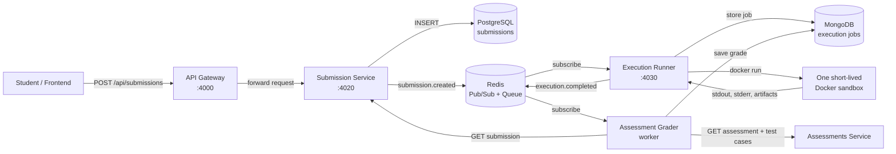
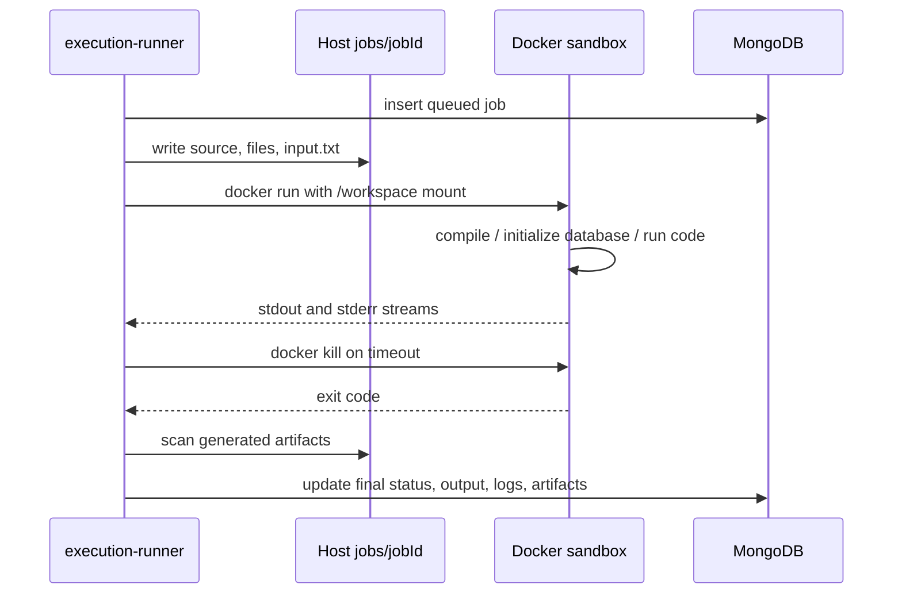

# Submission Service and Docker Execution Guide

> A code-first walkthrough of how a submission is accepted, stored, executed, graded, and returned through the system.

## 1. The Big Picture

The repository describes this flow:



There are two different kinds of Docker containers:

| Container type | Purpose | Defined by |
|---|---|---|
| Long-running service container | Runs TypeScript services such as submission-service and execution-runner | Each service's `Dockerfile`, started by `docker-compose.yml` |
| Short-lived execution container | Compiles/runs one student's code in isolation | `docker/cpp-runner`, `docker/python-dl`, or `docker/postgres-runner` |

The execution runner launches the second type dynamically by calling the Docker CLI.

---

## 2. Submission Service Ownership

The service owns a lightweight submission record. It does **not** compile code itself and it does **not** calculate marks.

| File | Responsibility |
|---|---|
| [`services/submission-service/src/index.ts`](services/submission-service/src/index.ts) | Loads environment variables, initializes PostgreSQL, starts HTTP server |
| [`services/submission-service/src/app.ts`](services/submission-service/src/app.ts) | Creates Express app, JSON parser, health check, and currently a placeholder endpoint |
| [`services/submission-service/src/routes.ts`](services/submission-service/src/routes.ts) | Intended CRUD route definitions |
| [`services/submission-service/src/controllers/submissionsController.ts`](services/submission-service/src/controllers/submissionsController.ts) | Rate limiting, duplicate detection, persistence, Redis event publishing |
| [`services/submission-service/src/models/submissionRepo.ts`](services/submission-service/src/models/submissionRepo.ts) | PostgreSQL queries and submission shape |
| [`services/submission-service/src/utils/db.ts`](services/submission-service/src/utils/db.ts) | PostgreSQL connection pool initialization |
| [`services/submission-service/migrations/20260816_create_submissions.sql`](services/submission-service/migrations/20260816_create_submissions.sql) | Service-specific `submissions` table |

### Startup sequence

1. `index.ts` calls `dotenv.config()`.
2. `getConfig()` reads shared configuration and environment variables.
3. The service chooses a port from `PORT`, then `PORT_SUBMISSION_SERVICE`, then `4020`.
4. `initDb(config)` creates a `pg.Pool` and runs `SELECT 1`.
5. Only after the database check succeeds does Express call `app.listen(...)`.

The database pool is stored in a module variable. Repository functions call `getPool()`, so calling a repository method before startup initialization throws `DB not initialized`.

---

## 3. HTTP Entry Points and Current Wiring

### Intended public API

The gateway registers:

```text
POST /api/submissions       -> submission-service POST /submissions
GET  /api/submissions       -> submission-service GET  /submissions
GET  /api/submissions/:id   -> submission-service GET  /submissions/:id
```

This forwarding is configured in [`services/api-gateway/src/index.ts`](services/api-gateway/src/index.ts), using the generic forwarding logic in [`services/api-gateway/src/proxy.ts`](services/api-gateway/src/proxy.ts). The gateway adds authentication before forwarding submission requests.

### What is actually mounted right now

[`services/submission-service/src/app.ts`](services/submission-service/src/app.ts) currently contains:

```ts
app.use(express.json());
app.get('/health', (_req, res) => res.json({ status: 'ok' }));
app.post('/submit', (req, res) => {
  res.json({ submissionId: 'placeholder-id' });
});
```

It does **not** currently contain `app.use('/submissions', router)`. Therefore:

| Request | Current result |
|---|---|
| `GET /health` | Works |
| `POST /submit` | Returns the placeholder ID; does not write to PostgreSQL |
| `POST /submissions` | 404, because `routes.ts` is not mounted |
| `GET /submissions` | 404, because `routes.ts` is not mounted |
| Gateway `POST /api/submissions` | Forwarded to `/submissions`, so currently reaches the 404 path |

This is the most important distinction when reading the rest of the architecture: the controller and repository implement the intended behavior, but the current Express app does not connect them to HTTP.

---

## 4. Intended `POST /submissions` Path

The route in [`routes.ts`](services/submission-service/src/routes.ts) maps `POST /` to `createSubmission`. If mounted at `/submissions`, the complete controller path is:

### Step 1: Rate limit by client IP

`createSubmission()` derives the IP from `req.ip` or `x-forwarded-for`.

* With `REDIS_URL`, it increments `rl:<ip>` and sets a 60-second TTL on the first request.
* Without Redis, it uses the process-local `Map` named `rateMap`.
* More than 10 requests in the window returns HTTP `429`.

The in-memory fallback only protects one process. It is not shared across replicas.

### Step 2: Validate the minimum field

The controller reads:

```text
submitter_id, assessment_id, practical_id, metadata, attachments
```

Only `submitter_id` is required by the current controller. Missing it returns HTTP `400`.

The execution runner later expects execution data inside `metadata`, especially `language`, `environment`, `code`, `stdin`, `files`, `time_limit_sec`, and `memory_mb`.

### Step 3: Reject a rapid identical duplicate

For an assessment, the controller calls `findLatestBySubmitterAssessment(...)`.

For a practical, it calls `findLatestBySubmitterPractical(...)`.

If the latest row is less than 10 seconds old and its `metadata` has the same `JSON.stringify(...)` value as the new metadata, the controller returns HTTP `429`. This is an anti-spam check, not a database uniqueness constraint.

### Step 4: Insert the row

`submissionRepo.create()`:

1. Generates a UUID with `uuidv4()` unless the caller supplied one.
2. Sets `status` to `pending` by default.
3. Writes `metadata` and `attachments` as PostgreSQL JSON values.
4. Sets both `created_at` and `updated_at` to the same timestamp.
5. Returns the inserted row using `RETURNING *`.

### Step 5: Publish `submission.created`

When Redis is configured, the controller publishes this shape to channel `submissions.events`:

```json
{
  "type": "submission.created",
  "data": {
    "id": "submission UUID",
    "submitter_id": "user UUID",
    "assessment_id": "optional UUID",
    "practical_id": "optional UUID",
    "metadata": {
      "language": "python",
      "code": "print(1)"
    },
    "attachments": []
  }
}
```

Without Redis, the current fallback only logs `submission.created`; it does not deliver the event to execution-runner. In that mode, a created submission will not automatically execute through the event path.

### Step 6: Return the row

Success returns HTTP `201` and the created database row. Database or Redis errors are logged and returned as HTTP `500` with `{ "error": "failed" }`.

---

## 5. Read Operations

The intended controller also exposes:

```text
GET /submissions
GET /submissions?submitter_id=<uuid>
GET /submissions/:id
```

* `listSubmissions()` returns up to 50 recent rows, or up to 100 rows for one submitter.
* `getSubmission()` returns one row or HTTP `404`.
* These operations read PostgreSQL only; they do not query MongoDB execution jobs.

---

## 6. How Execution Runner Receives a Submission

The consumer is in [`services/execution-runner/src/worker.ts`](services/execution-runner/src/worker.ts).

At startup, [`services/execution-runner/src/index.ts`](services/execution-runner/src/index.ts) does this in order:

1. Connects to MongoDB for job documents.
2. Starts the Redis worker.
3. Starts the Express API on port `4030`.

`startWorkerQueue()` creates a Redis subscriber and subscribes to `submissions.events`. When it receives `submission.created`, it calls `processSubmissionEvent()`.

That function translates the stored submission into an execution request:

| Submission value | Execution request value |
|---|---|
| `id` | `submission_id` |
| `submitter_id` | `submitter_id` |
| `assessment_id` | `assessment_id` |
| `practical_id` | `practical_id` |
| `metadata.language` | `language` |
| `metadata.environment` | `environment` |
| `metadata.code` | `code` |
| `metadata.stdin` | `stdin` |
| `metadata.files` | `files` |
| `metadata.time_limit_sec` | `time_limit_sec` |
| `metadata.memory_mb` | `memory_mb` |

Then `executeJob()` creates or updates a MongoDB job, selects an environment, runs the sandbox, stores output and artifacts, and publishes on `execution.events`.

The runner also supports direct HTTP execution through `POST /execute` and `POST /run`. Those paths can queue a job in Redis list `job_queue`; the same worker also consumes that list with `BLPOP`.

---

## 7. How the Docker Sandbox Runs

The controlling code is [`services/execution-runner/src/executor.ts`](services/execution-runner/src/executor.ts).

### Host-side preparation

For job ID `abc123`, the runner creates:

```text
jobs/abc123/
```

It writes:

* supplied `files` using each file's `name` and `content`;
* direct `code` to a default entry file;
* `stdin` to `input.txt`.

Default entry files are `main.py`, `main.cpp`, `query.sql`, or `train.py`, depending on the selected environment and code content.

### Docker command

The runner constructs the equivalent of:

```text
docker run --rm \
  --name vpl-exec-<jobId> \
  --network none \
  --memory=<memoryMb>m \
  --cpus=<cpuLimit> \
  -v <host-job-directory>:/workspace \
  <environment.dockerImage>
```

Important controls:

* `--rm` removes the container after it exits.
* `--network none` blocks network access from submitted code.
* Memory defaults come from the environment; the request can override them.
* CPU is `1.0` for C++ and PostgreSQL, `2.0` for Python DL.
* A watchdog kills the container after the requested time limit plus 1.5 seconds.
* stdout and stderr are streamed into the job log.
* Files left in `/workspace` are scanned as artifacts after execution.

On Windows, the host job path is normalized to forward slashes before it is passed to Docker Desktop.

### Sandbox lifecycle



---

## 8. The Three Custom Execution Images

### C/C++: `vpl-cpp-runner:1.0`

Defined in [`docker/cpp-runner/Dockerfile`](docker/cpp-runner/Dockerfile) and started by [`docker/cpp-runner/run.sh`](docker/cpp-runner/run.sh).

* Base image: Debian Bookworm slim.
* Installs GCC, G++, Make, pthread support, Bash, and core utilities.
* Runs as non-root user `runner`.
* If a `Makefile` exists, runs `make`.
* Otherwise compiles `main.c` with GCC or the selected source with C++17 G++.
* Runs the resulting program with `input.txt` redirected to stdin when present.

### Python and ML: `vpl-python-dl:1.0`

Defined in [`docker/python-dl/Dockerfile`](docker/python-dl/Dockerfile) and [`docker/python-dl/run.sh`](docker/python-dl/run.sh).

* Base image: Python 3.11 slim Bookworm.
* Installs the packages listed in [`docker/python-dl/requirements.txt`](docker/python-dl/requirements.txt).
* Supports Python scripts and Jupyter notebooks.
* Prefers `train.py`, then `main.py`, then `notebook.ipynb`.
* Executes notebooks with `jupyter nbconvert`.
* Runs as non-root user `runner`.

### PostgreSQL DBMS: `vpl-postgres-runner:1.0`

Defined in [`docker/postgres-runner/Dockerfile`](docker/postgres-runner/Dockerfile), [`docker/postgres-runner/run.sh`](docker/postgres-runner/run.sh), and [`docker/postgres-runner/sql-runner.py`](docker/postgres-runner/sql-runner.py).

* Base image: PostgreSQL 16 Bookworm.
* Starts a temporary PostgreSQL cluster under `/tmp/pgcluster`.
* Creates database `vpl_db` and waits until it is ready.
* Loads optional `schema.sql`.
* Executes `query.sql` or the first discovered `.sql` file.
* Writes human-readable output to stdout and structured results to `/workspace/execution_result.json`.
* The execution runner recognizes that JSON artifact and copies its `results` into the MongoDB job output.
* Stops the temporary PostgreSQL server before the container exits.

---

## 9. Grading After Execution

[`services/assessment-grader/src/index.ts`](services/assessment-grader/src/index.ts) subscribes to `execution.events`.

For `execution.completed` or `execution.failed`, [`services/assessment-grader/src/worker.ts`](services/assessment-grader/src/worker.ts):

1. Loads the execution job from MongoDB.
2. Calls `GET <SUBMISSION_SERVICE_URL>/submissions/<submission_id>`.
3. Skips grading when the submission has no `assessment_id`.
4. Calls the assessments service for assessment and test-case data.
5. Combines execution logs with submission output.
6. Checks whether each expected value appears in the logs.
7. Calculates a percentage score.
8. Stores an assessment-submission record.
9. Publishes `grading.completed` on Redis channel `grading.events`.

This means an assessment submission has two persistence locations:

* PostgreSQL: the original submission metadata and attachments.
* MongoDB: execution job state, logs, output, and artifacts.

---

## 10. Docker Compose Runtime Map

[`docker-compose.yml`](docker-compose.yml) starts the infrastructure and long-running services:

| Service | Host mapping | Dependency role |
|---|---:|---|
| PostgreSQL | `5432:5432` | Submission records and other relational data |
| Redis | `6379:6379` | Submission/execution/grading events and job queue |
| MongoDB | `27017:27017` | Execution job documents and logs |
| MinIO | `9000:9000` | File/object storage for the wider system |
| API Gateway | `4000:3000` | Authenticated public entry point |
| Submission service | `4020:4004` | Submission HTTP API |
| Execution runner | `4030:4030` | Execution HTTP API and Redis consumer |
| Assessment grader | no host port | Redis consumer for grading |
| File service | `4040:4040` | File/object storage API |

The execution runner receives `/var/run/docker.sock` and `./jobs:/app/jobs`. The socket allows the runner container to ask the host Docker daemon to create sandbox containers. The jobs volume makes the runner's workspace available to those containers.

### Building the custom images

The compose file builds the TypeScript services, but the language images are selected by name in `services/execution-runner/src/environments.ts`. They must exist before a job is executed, for example:

```powershell
docker build -t vpl-cpp-runner:1.0 .\docker\cpp-runner
docker build -t vpl-python-dl:1.0 .\docker\python-dl
docker build -t vpl-postgres-runner:1.0 .\docker\postgres-runner
docker compose up --build
```

The exact image names can be overridden with `IMAGE_CPP`, `IMAGE_PYTHON_DL`, and `IMAGE_POSTGRES`.

---

## 11. Important Current Gaps

These are implementation facts to resolve before relying on the complete flow:

1. **Submission router is not mounted.** Add the route mount in `app.ts` before expecting `/submissions` to work.
2. **`/submit` is still a placeholder.** It returns an ID but does not validate, persist, or publish an event.
3. **Port declarations disagree.** The submission Dockerfile exposes `4004`, Compose maps host `4020` to container `4004`, while the application default is port `4020`. Set `PORT=4004` inside the container or align the Dockerfile/Compose mapping.
4. **The schema sources differ.** The service migration defines `submitter_id`, `assessment_id`, `practical_id`, `metadata`, and `attachments`; the root initial schema defines a different older `submissions` shape with `student_id`, `activity_id`, `language`, and `code`. Apply the service migration or reconcile the schemas before running repository queries.
5. **Redis is required for automatic event-driven execution.** The controller's no-Redis fallback logs the event only.
6. **The execution runner needs Docker access.** Without Docker Desktop and the mounted Docker socket, job execution cannot spawn the sandbox.
7. **The grader depends on the intended submission routes.** Its callback to `/submissions/:id` will fail until the router is mounted and the database schema matches the repository.

## 12. One-Sentence Mental Model

The submission service records *what the student submitted* in PostgreSQL and announces it through Redis; execution-runner turns that announcement into a constrained, short-lived Docker process; MongoDB records *how it ran*; and assessment-grader uses the execution result and assessment test cases to produce a grade.
